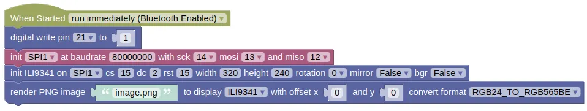

# PNG Decoder

This extension allows you to decode and display a PNG image on a compatible display.

Currently, the PNG Decoder extension can work with the SSD-1306, ILI9341, or ST7789 displays.

<div class="important">
PNG images are compressed using zlib. If the compression window size is too large, your ESP32 may not have enough memory to decode the image and will throw an Out-Of-Memory error. If this occurs, try recompressing your image with a lower window size (...oxipng allows you to do with with the --zw and --force option).
</div>

## Wiring

For this example, we are using the [ESP32 Cheap Yellow Display (CYD)](https://github.com/witnessmenow/ESP32-Cheap-Yellow-Display).
This device contains a ILI9341 display.
No wirings are required.

## Code

This code will draw the provided image on screen.
You can download and use the following image.


You'll need to upload the image to your device using "Connection Menu (3-dots) -> Files on Device -> Upload".

The code is written for an ILI9341 display on an ESP32 Cheap Yellow Display.
If you are using a different screen, you'll need to modify the code to suit.

### Blocks



Convert format must be set according to your display type.
If a suitable conversion isn't available, then your image must be of a format that matches your display type (eg. a 1-bit image when using an SSD-1306).

### Python

```python
import machine
import ili9341
import PNGdecoder
from ioty import pin

pin.digital_write(21, 1) # Turn on backlight
spi1 = machine.SPI(1, baudrate=80000000, sck=Pin(14), mosi=Pin(13), miso=Pin(12))
ili9341_device = ili9341.Display(spi1, cs=Pin(15), dc=Pin(2), rst=Pin(15), width=320, height=240, rotation=0, mirror=False, bgr=False)
PNGdecoder.png('image.png', callback=ili9341_device.draw_pixel, format=PNGdecoder.RGB24_TO_RGB565BE).render(0, 0)
```

### Results

You should see the specified image drawn on screen.

# `class PNGdecoder` - decode and draw PNG images

!!!!!
## Constructors

### PNGdecoder.png(source, callback=print, cache=False, bg=(0, 0, 0), fastalpha=True, format=NO_CONVERSION)

Returns a png object.

The arguments are:

* `source` A string representing the PNG file to render.

* `callback` A function for drawing the pixel to screen. This will be called with parameters `x`, `y`, `color`.

* `cache` A boolean. If True, the decoded image will be cached, making subsequent draws a little faster.

* `bg` A list containing Red, Green, and Blue values (0 to 255). When drawing a transparent PNG, this will be used as the background color.

* `fastalpha` A boolean. If True, every pixel in a transparent PNG will be drawn at full opacity, except for pixels which are fully transparent.

* `format` The conversion to perform for the pixel data.

    * `PNGdecoder.NO_CONVERSION` Don't perform any conversion.

    * `PNGdecoder.RGB24_TO_RGB565BE` Convert from 24bits RGB to 16bits RGB565 Big Endian.

    * `PNGdecoder.RGB24_TO_RGB565LE` Convert from 24bits RGB to 16bits RGB565 Little Endian.

Returns a png object.

## Methods

### png.render(x=0, y=0, placeholder=False, phcolor=0xBBBBBB)

Decode and draw the specified image.

Depending on your display device, you may need to perform a `show()` after drawing the image.

The arguments are:

* `x` / `y` An integer representing the x and y position to draw the image.

* `placeholder` A function for drawing a placeholder rectangle before rendering the image. This will be called with parameters `x`, `y`, `W`, `H`, `phcolor`. If False, no placeholder rectangle will be drawn.

* `phcolor` An integer representing the placeholder color.

Returns a png object.

### png.getMeta()

Get the meta data for the image.

Returns a tuple containing the Width, Height, Depth, and Color of the PNG image.
!!!!!