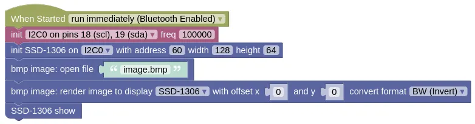

# BMP Image

This extension allows you to decode and display a BMP image on a compatible display.

Currently, the BMP Decoder extension can work with the SSD-1306, ILI9341, or ST7789 displays.

<div class="important">
The BMP format contains many features, most of which are rarely used. This extension only supports the most basic feature; most notably, it does not support compressed BMP files.
</div>

## Wiring

For this example, we are using the SSD1306 display.
You can refer to the SSD1306 section to learn more.


## Code

This code will draw the provided image on screen.
You can download and use the following image.


You'll need to upload the image to your device using "Connection Menu (3-dots) -> Files on Device -> Upload".

The code is written for a SSD1306 display.
If you are using a different screen, you'll need to modify the code to suit.

<div class="info">
The sample image is a 16bits color image, but the SSD-1306 is a monochrome display. The BMP Image extension can convert the image to a Black-and-White format suitable for the SSD-1306.
</div>

### Blocks



Convert format must be set according to your display type.
Here we are setting the format to White-and-Black (...inverted Black/White image).

### Python

```python
import machine
import ssd1306
import bmp_image

i2c0 = machine.I2C(0, freq=100000)
ssd1306_i2c = ssd1306.SSD1306_I2C(128, 64, i2c0, 60)
ssd1306_i2c.init_display()
bmp_image_file = bmp_image.BMP('image.bmp')
bmp_image_file.render(ssd1306_i2c.pixel, 0, 0, format=bmp_image.WB)
ssd1306_i2c.show()
```

### Results

You should see the specified image drawn on screen.

# `class BMP` - decode and draw BMP images

!!!!!
## Constructors

### bmp_image.BMP(filename)

Creates a BMP object.

The arguments are:

* `filename` A filename specifying the BMP file to open.

Returns a `BMP` object.

## Methods

### BMP.close()

Close the BMP file.

Returns None.

### BMP.get_pixel(format=RGB24)

Gets the next available pixel.

Every call to `get_pixel()` will return the next pixel, but note that BMP images are drawn bottom-up (ie. the first pixel is at the bottom left corner).

The arguments are:

* `format` The conversion to perform for the pixel data.

    * `bmp_image.NO_CONVERSION` Don't perform any conversion.

    * `bmp_image.RGB565BE` Convert to 16bits RGB565 Big Endian.

    * `bmp_image.RGB565LE` Convert to 16bits RGB565 Little Endian.

    * `bmp_image.RGB24` Convert to 24bits RGB.

    * `bmp_image.BW` Convert to 1bit Black / White.

    * `bmp_image.WB` Convert to 1bit White / Black (inverse of Black / White).

    * `bmp_image.LIST` Convert to a list containing Red, Green, and Blue values.

Returns pixel data in the format specified by the `format` argument.

### BMP.render(cb, x_offset, y_offset, format=RGB24)

Decode and draw the specified image.

Depending on your display device, you may need to perform a `show()` after drawing the image.

The arguments are:

* `cb` A function for drawing the pixel to screen. This will be called with parameters `x`, `y`, `color`.

* `x_offset` / `y_offset` An integer representing the x and y position to draw the image.

* `format` The conversion to perform for the pixel data.

    * `bmp_image.NO_CONVERSION` Don't perform any conversion.

    * `bmp_image.RGB565BE` Convert to 16bits RGB565 Big Endian.

    * `bmp_image.RGB565LE` Convert to 16bits RGB565 Little Endian.

    * `bmp_image.RGB24` Convert to 24bits RGB.

    * `bmp_image.BW` Convert to 1bit Black / White.

    * `bmp_image.WB` Convert to 1bit White / Black (inverse of Black / White).

    * `bmp_image.LIST` Convert to a list containing Red, Green, and Blue values.

Returns None.
!!!!!