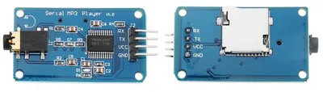
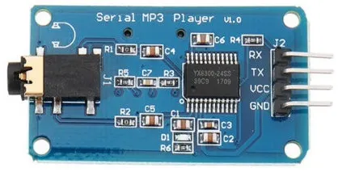
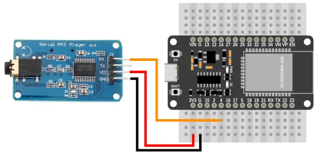
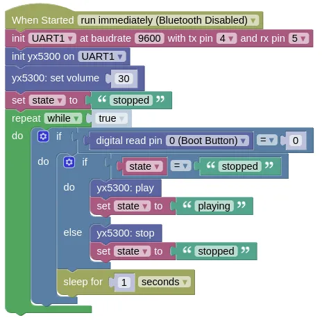

# Serial MP3 Player (YX5300, YX6300)



This extension allows control of the UART based YX5300 and YX6300 MP3 players.
These are often sold as "Catalex" Serial MP3.

The audio files should be stored in MP3 or WAV format, on a microSD card formatted in FAT16, VFAT, or FAT32.
The files should be prefixed with a unique 3 digit number (eg. 001Bohemian_Rhapsody.mp3, 002Money_for_Nothing.mp3), and may optionally be in folders named "01", "02", etc.
Max of 99 folders and 255 songs per folder.

<div class="important">
Note that the file index is based on the order that the file is written to the microSD card, and not the filename!
</div>

## Pins



| Pin | Description |
| --- | --- |
| VCC | Power for the sensor. Connect to **3V3**. If your device is on USB power, you can also use the 5V from **VIN**. |
| GND | Ground pin. This should be connected to the **GND** pin on the ESP32. |
| TX | Data transmit. This need not be connected, as the YX5300 does not send any data to the microcontroller. |
| RX | Data receive. This should be connected to the UART **TX** pin on the ESP32 (default is Pin 4). |

## Wiring



## Code

This code will switch between pause and play each time the boot button is pressed.

### Blocks



### Python

```python
import yx5300
import time
from ioty import pin

uart1 = machine.UART(1, baudrate=9600, tx=4, rx=5)
yx5300_device = yx5300.YX5300(uart1)
yx5300_device.set_volume(30)
state = 'stopped'
while True:
    if pin.digital_read(0) == 0:
        if state == 'stopped':
            yx5300_device.play()
            state = 'playing'
        else:
            yx5300_device.stop()
            state = 'stopped'
        time.sleep(1)
```

### Results

First, load one or more mp3 files into a microSD card and insert it into the YX5300.
The files should be prefixed with a unique 3 digit number (eg. 001Bohemian_Rhapsody.mp3, 002Money_for_Nothing.mp3), and may optionally be in folders named "01", "02", etc.

Connect headphones or speakers (...with amplifiers) to the headphone jack on the YX5300.

Load and run the sample program.
Press the boot button; you should hear the music start playing.
Pressing the boot button again should stop the music.

# `class YX5300` - control YX5300 serial MP3 player

!!!!!
## Constructors

### yx5300.YX5300(uart)

Creates a YX5300 object.

The arguments are:

* `uart` A UART object.

Returns a `YX5300` object.

## Methods

### YX5300.play()

Starts playback.

Returns `None`.

### YX5300.pause()

Pause playback.
The next time you run `play()`, the playback will continue from the point it was paused.

Returns `None`.

### YX5300.stop()

Stop playback.
The next time you run `play()`, the playback will start again from the beginning.

Returns `None`.

### YX5300.play_next()

Skip to the next song.

Returns `None`.

### YX5300.play_prev()

Jumps to the previous song.

Returns `None`.

### YX5300.play_index(index)

Jump to the song at the specified index.
Note that the index is based on the order that the file is written to the microSD card, and not the filename!

The arguments are:

* `index` An integer (starting from 1) specifying the song to play.

Returns `None`.

### YX5300.play_folder_index(folder, file)

Jump to the song within the specified folder.

The arguments are:

* `folder` An integer (starting from 1) specifying the folder to use.

* `file` An integer (starting from 1) specifying the song within the folder to play.

Returns `None`.

### YX5300.volume_up()

Increase volume by 1 (max of 30).

Returns `None`.

### YX5300.volume_down()

Decrease volume by 1 (min of 0).

Returns `None`.

### YX5300.set_volume(volume)

Sets the volume.

The arguments are:

* `volume` An integer (0 to 30) specifying the volume.

Returns `None`.
!!!!!