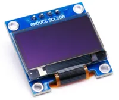
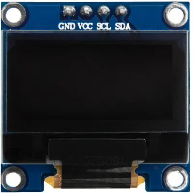
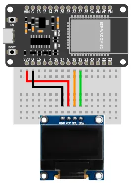
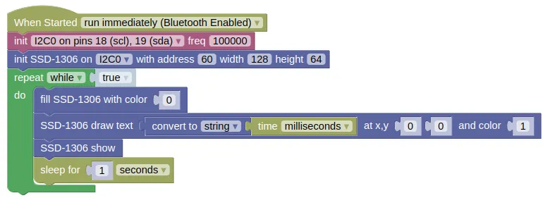

# OLED Screen (SSD1306)



The SSD1306 is a cheap and commonly available OLED screen.
It is rather small (~1 inch diagonal), but has high contrast giving a crisp and clear image.
Features of the board includes...

* Available in 128x64 and 128x32 pixel resolution
* Monochrome (...each pixel is either fully on or fully off)
* Available in white, blue, and yellow (...it cannot change color; if you buy a white board, it will only display white)
* Communicates over I2C (...also available in SPI, but IoTy doesn't provide blocks for that)

## Pins



| Pin | Description |
| --- | --- |
| GND | Ground pin. This should be connected to the **GND** pin on the ESP32. |
| VCC | Power for the OLED. You can use 3.3V or 5V. |
| SCL (Signal) | Serial Clock. This is used to communicate with the ESP32 using the I2C protocol (default pin 18). |
| SDA (Signal) | Serial Data. This is used to communicate with the ESP32 using the I2C protocol (default pin 19). |

## Wiring

The example below uses power from **3V3**.
You can also use power from **VIN** if your ESP32 is running on 5V (eg. USB power).



## Code

This code will display the time in milliseconds, updating once every second.
The `fill(0)` is necessary to clear the screen by filling it with black; without it, new text will be drawn over the previous text.

### Blocks



The `draw text` block only accepts strings as input, so you must use a `convert to` block to convert the time (integer) into a string.
You can find the `convert to` block in the `Data` category.

### Python

```python
import machine
import ssd1306
import time

i2c0 = machine.I2C(0, freq=100000)
ssd1306_i2c = ssd1306.SSD1306_I2C(128, 64, i2c0, 60)
ssd1306_i2c.init_display()
while True:
    ssd1306_i2c.fill(0)
    ssd1306_i2c.text((str(time.ticks_ms())), 0, 0, 1)
    ssd1306_i2c.show()
    time.sleep(1)
```

### Results

You should see the time (...in milliseconds since reset) drawn on the screen and updating every 1 second.

## Related Extensions

* **Scaled Text** This extension scales the built-in font to allow drawing of larger text.
* **PNG Decoder** Decodes and draw PNG images to screen.
* **BMP Image** Decodes and draw BMP images to screen.


# `class SSD1306` - control SSD1306 and SH1106 OLED displays

!!!!!
## Constructors

### ssd1306.SSD1306(width, height, external_vcc)

Do **NOT** use this constructor.
You should used the `SSD1306_I2C` or `SSD1306_SPI` constructors instead.

The SSD1306 class extends micropython's built-in [`FrameBuffer`](https://docs.micropython.org/en/latest/library/framebuf.html) class.

Returns an `SSD1306` object.

### ssd1306.SSD1306_i2c(width, height, i2c, addr=60, external_vcc=False, driver=TYPE_SSD1306)

Use this constructor if your OLED is connected via I2C.

The SSD1306 class extends micropython's built-in [`FrameBuffer`](https://docs.micropython.org/en/latest/library/framebuf.html) class.

The arguments are:

* `width` An integer specifying the width of the screen in pixels.

* `height` An integer specifying the height of the screen in pixels.

* `i2c` An i2c object.

* `addr` The i2c address of the OLED. By default, this should be 60.

* `external_vcc` Set to `True` if you are not using the internal charge pump. You should almost always leave this as `False`.

* `driver` The type of OLED you're using, which can be one of the following:

    * `ssd1306.TYPE_SSD1306` For SSD1306 displays.

    * `ssd1306.TYPE_SH1106` For SH1106 displays.

Returns an `SSD1306` object.

### ssd1306.SSD1306_spi(width, height, spi, dc, res, cs, external_vcc=False)

Use this constructor if your OLED is connected via SPI.

The SSD1306 class extends micropython's built-in [`FrameBuffer`](https://docs.micropython.org/en/latest/library/framebuf.html) class.

The arguments are:

* `width` An integer specifying the width of the screen in pixels.

* `height` An integer specifying the height of the screen in pixels.

* `spi` An spi object.

* `dc` A `Pin` object initialize to the pin that is connected to **DC** on the OLED.

* `res` A `Pin` object initialize to the pin that is connected to **RES** on the OLED.

* `cs` A `Pin` object initialize to the pin that is connected to **CS** on the OLED.

* `external_vcc` Set to `True` if you are not using the internal charge pump. You should almost always leave this as `False`.

Returns an `SSD1306` object.

## Methods

### SSD1306.poweroff()

Powers off the OLED.
Useful if you need to reduce power consumption.

Returns `None`.

### SSD1306.poweron()

Powers on the OLED.
Useful if you need to reduce power consumption.

Returns `None`.

### SSD1306.contrast(contrast)

Sets the screen contrast.

The arguments are:

* `contrast` An integer specifying the contrast (0 to 255).

Returns `None`.

### SSD1306.invert(invert)

Inverts the color (`0` becomes **On**, and `1` become **Off**).

The arguments are:

* `invert` An integer (0 or 1). Turns on inversion when `1` and off when `0`.

Returns `None`.

### SSD1306.rotate(rotate)

Rotates the screen by 180 degrees.

The arguments are:

* `rotate` An integer (0 or 1). Turns on rotation when `1` and off when `0`.

Returns `None`.

### SSD1306.show()

Display whatever was drawn to screen.
Draw commands (eg. `text`, `line`, `rect`) will not appear on screen until you run `show`.

Returns `None`.

### SSD1306.fill(c)

Fill the entire screen with the specified color.

The arguments are:

* `c` An integer, `0` (black) or `1` (white).

Returns `None`.

### SSD1306.pixel(x, y [, c])

If c is not given, get the color value of the specified pixel. If c is given, set the specified pixel to the given color.

The arguments are:

* `x` An integer specifing the x position.

* `y` An integer specifying the y position.

* `c` An integer, `0` (black) or `1` (white).

Returns an `integer` representing the color if c is not given, else `None`.

### SSD1306.hline(x, y, w, c)

### SSD1306.vline(x, y, h, c)

### SSD1306.hline(x1, y1, x2, y2, c)

Draw a line from a set of coordinates using the given color and a thickness of 1 pixel. The line method draws the line up to a second set of coordinates whereas the hline and vline methods draw horizontal and vertical lines respectively up to a given length.

The arguments are:

* `x`, `x1` An integer specifing the starting x position.

* `y`, `y1` An integer specifying the starting y position.

* `w`, `h` An integer specifying the width / height.

* `x2`, `y2` An integer specifying the ending x/y position.

* `c` An integer, `0` (black) or `1` (white).

Returns `None`.

### SSD1306.rect(x, y, w, h, c [, f])

Draw a rectangle at the given location, size and color.

The optional f parameter can be set to True to fill the rectangle. Otherwise just a one pixel outline is drawn.

The arguments are:

* `x` An integer specifing the upper left corner x position.

* `y` An integer specifying the upper left corner y position.

* `w`, `h` An integer specifying the width / height.

* `c` An integer, `0` (black) or `1` (white).

* `f` A boolean. `True` to fill the shape, `False` to draw only outlines.

Returns `None`.

### SSD1306.ellipse(x, y, xr, yr, c [, f, m])

Draw an ellipse at the given location. Radii xr and yr define the geometry; equal values cause a circle to be drawn. The c parameter defines the color.

The optional f parameter can be set to True to fill the ellipse. Otherwise just a one pixel outline is drawn.

The arguments are:

* `x` An integer specifing the center x position.

* `y` An integer specifying the center y position.

* `xr`, `yr` An integer specifying the radius along the x/y axis.

* `c` An integer, `0` (black) or `1` (white).

* `f` A boolean. `True` to fill the shape, `False` to draw only outlines.

* `m` The optional m parameter enables drawing to be restricted to certain quadrants of the ellipse. The LS four bits determine which quadrants are to be drawn, with bit 0 specifying Q1, b1 Q2, b2 Q3 and b3 Q4. Quadrants are numbered counterclockwise with Q1 being top right.

Returns `None`.

### SSD1306.poly(x, y, coords, c [, f])

Given a list of coordinates, draw an arbitrary (convex or concave) closed polygon at the given x, y location using the given color.

The arguments are:

* `x` An integer specifing the starting x position.

* `y` An integer specifying the starting y position.

* `coords` The coords must be specified as a array of integers, e.g. `array('h', [x0, y0, x1, y1, ... xn, yn])`.

* `c` An integer, `0` (black) or `1` (white).

* `f` A boolean. `True` to fill the shape, `False` to draw only outlines.

Returns `None`.

### SSD1306.text(s, x, y, c)

Write text to the FrameBuffer using the the coordinates as the upper-left corner of the text. The color of the text can be defined by the optional argument but is otherwise a default value of 1. All characters have dimensions of 8x8 pixels and there is currently no way to change the font.

The arguments are:

* `s` A string specifying the text to draw.

* `x` An integer specifing the upper left corner x position.

* `y` An integer specifying the upper left corner y position.

* `c` An integer, `0` (black) or `1` (white).

Returns `None`.

### SSD1306.scroll(xstep, ystep)

Shift the contents of the FrameBuffer by the given vector. This may leave a footprint of the previous colors in the FrameBuffer.

The arguments are:

* `xstep` An integer specifing the distance in pixels to shift along the x axis.

* `ystep` An integer specifing the distance in pixels to shift along the y axis.

Returns `None`.

### SSD1306.blit(fbuf, x, y, key=-1, palette=None)

Draw another FrameBuffer on top of the current one at the given coordinates. If key is specified then it should be a color integer and the corresponding color will be considered transparent: all pixels with that color value will not be drawn. (If the palette is specified then the key is compared to the value from palette, not to the value directly from fbuf.)

The arguments are:

* `fbuf` A framebuffer object.

* `x` An integer specifing the upper left corner x position.

* `y` An integer specifying the upper left corner y position.

* `key` An integer specifying the color to be considered transparent.

* `palette` The palette argument enables blitting between FrameBuffers with differing formats. Typical usage is to render a monochrome or grayscale glyph/icon to a color display. The palette is a FrameBuffer instance whose format is that of the current FrameBuffer. The palette height is one pixel and its pixel width is the number of colors in the source FrameBuffer. The palette for an N-bit source needs 2**N pixels; the palette for a monochrome source would have 2 pixels representing background and foreground colors. The application assigns a color to each pixel in the palette. The color of the current pixel will be that of that palette pixel whose x position is the color of the corresponding source pixel.

Returns `None`.
!!!!!