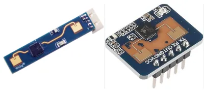
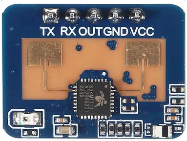
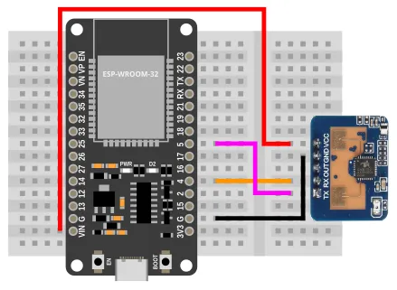
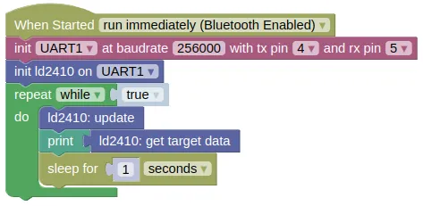

# Human Presence Radar (LD2410)



The LD2410 uses a 24GHz radar to detect the presence of people.
Unlike Infrared or Ultrasonic sensors, it can detect both moving and stationary people, and provide an approximate range.

This can be useful to detect when someone is in a room or near to your device.

## Pins



| Pin | Description |
| --- | --- |
| VCC | Power for the sensor (5V). If your device is on USB power, you can use the 5V from **VIN**, else you'll need to provide a separated 5V power supply for it. |
| GND | Ground pin. This should be connected to the **GND** pin on the ESP32. |
| TX | Data transmit. This should be connected to the UART **RX** pin on the ESP32 (default is Pin 5). |
| RX | Data receive. This should be connected to the UART **TX** pin on the ESP32 (default is Pin 4). |
| OUT | Optionally provides a present / not-present signal. |

<div class="info">
The LD2410S supports 3.3V power. It can be an option if 5V is not available in your project, but note that its stationary detection range is shorter than the other LD2410 versions.
</div>

## Wiring



## Code

This code will return the full detection data as a list.

<div class="important">
The default baudrate for the LD2410 is 256000. You must initialize your UART device accordingly.
</div>

### Blocks



### Python

```python
import machine
import ld2410
import time

uart1 = machine.UART(1, baudrate=256000, tx=4, rx=5)
ld2410_device = ld2410.LD2410(uart1)
while True:
    ld2410_device.update()
    print(ld2410_device.get_target_data())
    time.sleep(1)
```

### Results

The result will be printed to the monitor as a list every one second.
The list contains; "state, moving target dist (cm), moving target energy, stationary target dist (cm), stationary target energy, detection distance".
The meaning of these are...

* **state** 0: None, 1: Moving target, 2: Stationary target, 3: Both targets.

* **moving target dist** Distance (cm) at which a moving target was detected.

* **moving target energy** The detection confidence level, between 0 (low confidence) to 100 (very confident).

* **stationary target dist** Distance (cm) at which a stationary target was detected.

* **stationary target energy** The detection confidence level, between 0 (low confidence) to 100 (very confident).

* **detection distance** I don't know what this means.

Try moving around and staying stationary at different ranges and observe the changes in the printed values.

# `class LD2401` - control LD2410 Human Presence Radar

!!!!!
## Constructors

### ld2410.LD2410(uart)

Creates a LD2410 object.

The arguments are:

* `uart` A UART object.

Returns a `LD2410` object.

## Gates

The returned data and settings often refers to **gates**, which represent a distance range.
Each gate has a energy level threshold for detecting movement and stationary presence.

| Gate | Distance | Move threshold | Stationary threshold |
| --- | --- | --- | --- |
| 0 | 0cm | 50 | 0 |
| 1 | 0 to 75cm | 50 | 0 |
| 2 | 75 to 150cm | 40 | 40 |
| 3 | 150 to 225cm | 30 | 40 |
| 4 | 225 to 300cm | 20 | 30 |
| 5 | 300 to 375cm | 15 | 30 |
| 6 | 375 to 450cm | 15 | 20 |
| 7 | 450 to 525cm | 15 | 20 |
| 8 | 525 to 600cm | 15 | 20 |

## Methods

### LD2410.update()

Reads data from the sensor.
You must run this frequently.

Returns `None`.

### LD2410.get_target_data()

Get the target data.

Returns a list containing "state, moving target dist (cm), moving target energy, stationary target dist (cm), stationary target energy, detection distance".
The meaning of these are...

* **state** 0: None, 1: Moving target, 2: Stationary target, 3: Both targets.

* **moving target dist** Distance (cm) at which a moving target was detected.

* **moving target energy** The detection confidence level, between 0 (low confidence) to 100 (very confident).

* **stationary target dist** Distance (cm) at which a stationary target was detected.

* **stationary target energy** The detection confidence level, between 0 (low confidence) to 100 (very confident).

* **detection distance** Unclear what this means..

### LD2410.get_engineering_data()

Get the engineering data.
This contains more information than the target data, but engineering mode must be enabled.

Returns a list containing "max moving gate, max stationary gate, moving gate energy, stationary gate energy".
The meaning of these are...

* **max moving gate** The maximum gate at which the moving energy is detected.

* **max stationary gate** The maximum gate at which the stationary energy is detected.

* **moving gate energy** A list containing the energy level for each gate.

* **stationary gate energy** A list containing the energy level for each gate.

### LD2410.enable_config()

Enables changing of configurations.
You must run `enable_config()` before changing any configuration values, and run `disable_config()` after making the change.

Returns `None`.

### LD2410.disble_config()

Disbles changing of configurations.
You must run `enable_config()` before changing any configuration values, and run `disable_config()` after making the change.

Returns `None`.

### LD2410.set_max_values(moving_gate, stationary_gate, inactivity_time)

Sets configurations.

The arguments are:

* `moving_gate` An integer representing the maximum gate which will detect a moving person.

* `stationary_gate` An integer representing the maximum gate which will detect a stationary person.

* `inactivity_time` An integer representing the time in seconds during which the output will stay on after is lost.

Returns `None`.

### LD2410.enable_engineering_mode()

Enables engineering mode.
You must be in engineering mode to obtain data from `get_engineering_data()`.

Note that the device always starts with engineering mode disabled.

Returns `None`.

### LD2410.disable_engineering_mode()

Disables engineering mode.

Returns `None`.

### LD2410.set_gate_sensitivity(gate, moving, stationary)

Sets the sensitivity threshold for the specified gate.
Energy level for the gate must be above its sensitivity threshold for movement to be detected.

As the maximum energy level is 100, if the sensitivity threshold is set to 100, that gate will be effectively disabled.

Note that this setting will persist across a power cycle.

The arguments are:

* `gate` An integer representing gate that you are setting the sensitivity threshold for.

* `moving` An integer representing the moving sensitivity threshold.

* `stationary` An integer representing the stationary sensitivity threshold.

Returns `None`.

### LD2410.get_firmware_version()

Gets the version of the LD2410 firmware.

Returns a tuple containing 3 integers (firmware type, major version, minor version).

### LD2410.set_baudrate(baudrate)

Sets the baudrate.

The arguments are:

* `baudrate` The baudrate setting, which can be one of the following:

    * `1` Set the baudrate to 9600.

    * `2` Set the baudrate to 19200.

    * `3` Set the baudrate to 38400.

    * `4` Set the baudrate to 57600.

    * `5` Set the baudrate to 115200.

    * `6` Set the baudrate to 230400.

    * `7` Set the baudrate to 256000. This is the factory default.

    * `8` Set the baudrate to 460800.

### LD2410.factory_reset()

Reset all settings to the factory default.

Returns `None`.

### LD2410.restart()

Restart the device.

Returns `None`.
!!!!!