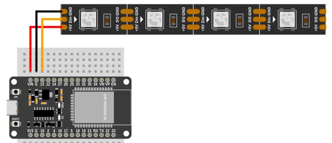

# Neopixel (WS2812 LEDs)


The Neopixel (aka WS2812 LEDs) are chainable, individually addressable, RGB LEDs, that uses only a single data line.
What this means is...

* **Chainable** You can join them together to make them longer, or cut them to make them shorter.
* **Individually Addressable** You can control each LED individually (ie. 1st LED Red, 2nd LED Blue, 3rd LED Yellow, etc).
* **RGB LED** You can control the proportion of Red, Green, and Blue for each LED to create any colors.
* **Single Data Line** Besides power, you only need to connect a single data line from your microcontroller to control all the LEDs.

The Neopixel is available in flexible strips, rings, boards, and many other configurations.
They all work the same.

<div class="info">
Strictly speaking, Neopixel refers to the Adafruit brand of WS2812 LEDs.
All WS2812 LEDs works the same, and this extension supports all of them, but we use the name "Neopixel" simple because it sounds better.
</div>

## Pins


| Pin | Description |
| --- | --- |
| GND | Ground pin. This should be connected to the **GND** pin on the ESP32. |
| 5V | Power for the Neopixel. If using USB power, you can connect it to the **VIN** pin on your ESP32. |
| DI / Din | Data input. Connect this to one of the output capable pins on the ESP32. |
| DO | Data output. When chaining Neopixels, connect this to the **DI** pin on the next Neopixel strip. |

## Wiring

The example below uses power from **VIN**; this only works if your ESP32 is running on 5V (eg. USB power).

Too many LED pixels may overload the 5V power supply.
If using USB power, about 10 pixels are fine, anything more may lead to instability.
If you need to power a large number of pixels, you should use a separate power supply that can supply sufficient current (~60mA per pixel).



## Code

This code will switch all the pixels between red and blue.

### Blocks


Note that setting the pixels does not change the LED colors; you must run `write Neopixel` for the LED colors to change.

### Python

```python
import ioty_neopixel
import time

ioty_neopixel.init(13, 4, format=3)
while True:
    ioty_neopixel.fill(13, (255, 0, 0))
    ioty_neopixel.write(13)
    time.sleep(1)
    ioty_neopixel.fill(13, (0, 0, 255))
    ioty_neopixel.write(13)
    time.sleep(1)
```

The `ioty_neopixel` module provides a thin wrapper over the `neopixel` module built into micropython.
You can also use the built-in `neopixel` directly; refer to the [micropython documentations](https://docs.micropython.org/en/latest/library/neopixel.html).

### Results

You should see the LEDs switch between red and blue every 1 second.

# `ioty_neopixel` - control Neopixel / WS2812 LEDs

!!!!!
## Constructors

None.

Use the functions provided by `ioty_neopixel`.

## Functions

### ioty_neopixel.init(pin, pixels, format=3)

Initialize the Neopixel connected to the specified pin.
You may call this multiple times if you have Neopixels connected to different pins.

The arguments are:

* `pin` An integer specifying the pin that the Neopixel data line is connected to.

* `pixels` An integer specifying the number of pixels in this Neopixel.

* `format` An integer. `3` for RGB LEDs and `4` for RGBW LEDs.

Returns `None`.

### ioty_neopixel.set(pin, pixels, color)

Set the color for one pixel.
You must run `write` for the colors to appear on the LEDs.

The arguments are:

* `pin` An integer specifying the pin that the Neopixel data line is connected to.

* `pixels` An integer specifying the pixel to set. Starts from `0`.

* `color` A list containing 3 integers for the red, green, and blue values (0 to 255).

Returns `None`.

### ioty_neopixel.fill(pin, color)

Set the color for all pixels.
You must run `write` for the colors to appear on the LEDs.

The arguments are:

* `pin` An integer specifying the pin that the Neopixel data line is connected to.

* `color` A list containing 3 integers (red, green, and blue) each ranging from 0 to 255. If using a RGBW LED, then it should be a list containing 4 integers (red, green, blue, and white) each ranging from 0 to 255.

Returns `None`.

### ioty_neopixel.write(pin)

Write the pixel colors that you have previously set to the LEDs.

The arguments are:

* `pin` An integer specifying the pin that the Neopixel data line is connected to.

Returns `None`.

### ioty_neopixel.hsv2rgb(h, s, v)

Converts a [HSV](https://en.wikipedia.org/wiki/HSL_and_HSV) value to RGB.

The arguments are:

* `h` A number specifying the Hue (0 to 360).

* `s` A number specifying the Saturation (0 to 1.0).

* `v` A number specifying the Value (0 to 1.0).

Returns a list containing 3 integers (red, green, and blue) each ranging from 0 to 255.
!!!!!