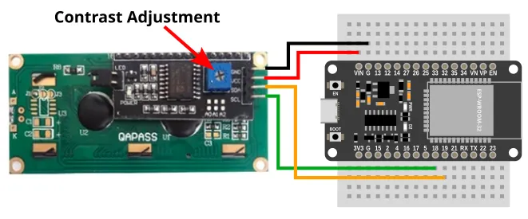

# I2C LCD (HD44780 + PCF8574)


The HD44780 is a popular LCD screen, often paired with a PCF8574 IO expander for I2C control.
This extensions allows you to write text to such a screen.

<div class="important">
Some HD44780 do not come with the PCF8574. This extension does not work on devices without the PCF8574! Compare your device with the above image to make sure you have the right type.
</div>

## Pins


| Pin | Description |
| --- | --- |
| GND | Ground pin. This should be connected to the **GND** pin on the ESP32. |
| VCC | Power for the LCD. Connect to 5V. If using USB power, you can connect to the **VIN** pin on the ESP32. |
| SCL (Signal) | Serial Clock. This is used to communicate with the ESP32 using the I2C protocol. |
| SDA (Signal) | Serial Data. This is used to communicate with the ESP32 using the I2C protocol. |

## Wiring

The example below uses power from **VIN**, this only works if your ESP32 is running on 5V (eg. USB power).



## Code

This code will display the time in milliseconds, updating once every second.

<div class="important">
You will often need to adjust the contrast before any text is visible. You'll need a screwdriver to turn the potentiometer (blue square with screwdriver slot).
</div>


### Blocks


The `draw text` block only accepts strings as input, so you must use a `convert to` block to convert the time (integer) into a string.
You can find the `convert to` block in the `Data` category.

### Python

```python
import machine
import i2c_lcd
import time

i2c0 = machine.I2C(0, freq=100000)
lcd = i2c_lcd.LCD(i2c0, 39, 2, 16)
while True:
    lcd.clear()
    lcd.putstr(str(time.ticks_ms()))
    time.sleep(1)
```

### Results

You should see the time (...in milliseconds since reset) drawn on the screen and updating every 1 second.

# `class LCD` - control HD44780 LCD screens with PCF8574 IO expander

!!!!!
## Constructors

### i2c_lcd.LCD(i2c, i2c_addr=39, num_lines=2, num_columns=16)

Creates an LCD object.

The arguments are:

* `i2c` An i2c object.

* `i2c_addr` The i2c address of the PCF8574. By default, this should be 39.

* `num_lines` An integer specifying the number of lines of text (...not pixels) on the screen.

* `num_columns` An integer specifying the number of character columns on the screen.

Returns an `LCD` object.

## Methods

### LCD.clear()

Clears the screen and set the cursor to the top left corner (0, 0).

Returns `None`.

### LCD.show_cursor()

Display the cursor on screen.

Returns `None`.

### LCD.hide_cursor()

Hides the cursor on screen.

Returns `None`.

### LCD.blink_cursor_on()

Makes the cursor blink.

Returns `None`.

### LCD.blink_cursor_off()

Turns cursor blinking off.

Returns `None`.

### LCD.display_on()

Turns on the display.

Returns `None`.

### LCD.display_off()

Turns off the display

Returns `None`.

### LCD.backlight_on()

Turns on the backlight.

Returns `None`.

### LCD.backlight_off()

Turns off the backlight.

Returns `None`.

### LCD.move_to(cursor_x, cursor_y)

Move the cursor to the specified position.

The arguments are:

* `cursor_x` An integer specifying the x position to move to.

* `cursor_y` An integer specifying the y position to move to.

Returns `None`.

### LCD.putchar(char)

Draw a character at the current cursor position.
This will automatically wrap to the next line when it reaches the end of the line.
It will also wrap back to the top of the screen when it reaches the bottom.

The arguments are:

* `char` A string containing a single character.

Returns `None`.

### LCD.putstr(string)

Draw a string starting at the current cursor position.
This will automatically wrap to the next line when it reaches the end of the line.
It will also wrap back to the top of the screen when it reaches the bottom.

The arguments are:

* `string` A string containing the text to draw.

Returns `None`.

### LDC.custom_char(location, charmap)

Add a custom char.
The HD44780 can store up to 8 custom characters, each character is monochrome and 5x8 pixels.

This can be complicated to use.
Refer to the **Custom Characters** section in the [docs here](https://github.com/dhylands/python_lcd/tree/master) to learn how.

The arguments are:

* `location` A number (0 to 7) specifying the location to store the custom character.

* `charmap` A bytes object providing the character map of the custom character.

Returns `None`.
!!!!!