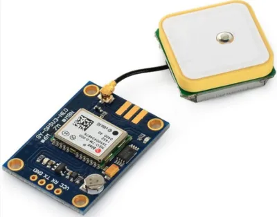
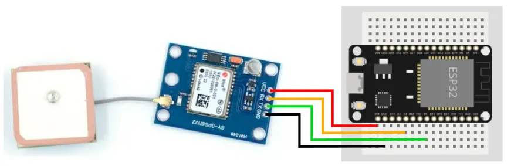
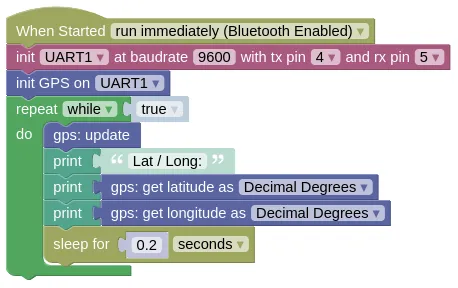

# GPS (NMEA over serial)



Most GPS modules returns [NMEA](https://en.wikipedia.org/wiki/NMEA_0183) data over a serial line.
This extension reads and parse the data from the GPS module to provide you with useful data (eg. latitude, longitude, time).

<div class="info">
The GPS module shown above is the NEO-6M, but most GPS modules should work with this extension.
</div>

## Pins

Depending on your GPS model, the pin order will be different, but most should have the following pins:

| Pin | Description |
| --- | --- |
| VCC | Power for the sensor. Connect to **3V3**. If your device is on USB power, you can also use the 5V from **VIN**. |
| GND | Ground pin. This should be connected to the **GND** pin on the ESP32. |
| TX | Data transmit. This should be connected to the UART **RX** pin on the ESP32 (default is Pin 5). |
| RX | Data receive. This should be connected to the UART **TX** pin on the ESP32 (default is Pin 4). |

Note that **TX** on the GPS is connected to **RX** on the microcontroller, and **RX** on the GPS is connected to **TX** on the microcontroller.

## Wiring



<div class="tip">
You don't necessarily have to connect the RX pin on the GPS. That is only used to configure the GPS module, and we usually don't need to configure it. Configurations are model specific, and the GPS extension do not provide any configuration functions.
</div>

## Code

This code will print out the latitude and longitude.

The `update` is required to read from the GPS, and needs to run frequently.
Here we introduce a 0.2s sleep to prevent printing too often to the monitor; if you don't need to print to monitor, you should run without any sleep.

<div class="tip">
Long sleep can cause issues as you might miss some of the messages from the GPS. You can use the EZ Timer extension to print to monitor at long intervals (eg. every 2 seconds), without using sleep.
</div>

### Blocks



If your GPS is using a different baudrate, you will need to change the `9600`.

If you wired your **RX** / **TX** to a different pair of pins, you'll need to change the pins in the `init UART` block.

### Python

```python
import machine
import gps
import time

# Modify the next line if your baudrate and pins are different
uart1 = machine.UART(1, baudrate=9600, tx=4, rx=5)
gps_device = gps.GPS(uart1)
while True:
    gps_device.update()
    print('Lat / Long:', gps_device.get_lat(), gps_device.get_lng())
    time.sleep(0.2)
```

### Results

It can take a few minutes for the GPS to retrieve its latitude / longitude.
You will also need a clear view of the sky for it to work.
Until then, you will see `Lat / Long` followed by `None` printed in the monitor.

When the GPS obtains its position, you should start seeing the latitude and longitude printed in the monitor.

# `class GPS` - read NMEA compatible GPS units

!!!!!
## Constructors

### gps.GPS(uart)

Creates a GPS object.

The arguments are:

* `uart` A UART object.

Returns a `GPS` object.

## Methods

### GPS.update()

Reads data from the GPS.
You must run this frequently.

Returns `True` if it managed to read a message from the GPS, else it'll return `False`.
You can usually ignore this, but it may be useful for troubleshooting.

### GPS.get_lat_ddm() / GPS.get_lng_ddm()

Get the latitude or longitude in DDM (Degree, Decimal Minute) format.

You must run `update()` frequently for this to return valid data.

Examples:

* **1.5 degrees North** will return `[1, 30, b'N']`
* **2.75 degrees South** will return `[2, 45, b'S']`

Returns `None` if GPS data isn't available yet, else a `tuple` containing 3 items `degree, minute, dir`:

* `degree` An integer representing the degrees part of the latitude or longitude.

* `minute` A float representing the minutes part of the latitude or longitude.

* `dir` A bytes representing 'N', 'S', 'E', 'W'.

### GPS.get_lat() / GPS.get_lng()

Get the latitude or longitude in DD (Decimal Degree) format.

You must run `update()` frequently for this to return valid data.

Examples:

* **1.5 degrees North** will return `1.5`
* **2.75 degrees South** will return `-2.75`

Returns `None` if GPS data isn't available yet, else a `float` representing the latitude / longitude.

### GPS.get_alt()

Gets the altitude above mean sea level.

You must run `update()` frequently for this to return valid data.

Returns `None` if GPS data isn't available yet, else a `float` representing the altitude in meters.

### GPS.get_time()

Gets the current UTC time (GMT +0).
You'll need to perform your own conversion if you require local time.

You must run `update()` frequently for this to return valid data.

Returns `None` if GPS data isn't available yet, else a `tuple` containing 3 items `hours, minutes, seconds`:

* `hours` An integer representing the hour.

* `minutes` An integer representing the minute.

* `seconds` A float representing the seconds.

### GPS.get_date()

Gets the current UTC date (GMT +0).
You'll need to perform your own conversion if you require local date.

You must run `update()` frequently for this to return valid data.

Returns `None` if GPS data isn't available yet, else a `tuple` containing 3 items `day, month, year`:

* `day` An integer representing the day.

* `month` An integer representing the month.

* `year` An integer representing the year (eg. 2024).

### GPS.get_datetime()

Gets the current UTC date and time in a format that's compatible with the `set date and time to` block or the Python `machine.RTC().datetime()`.

When setting date and time, you can add/subtract to the hours/minutes to convert to local time.
This works even if the addition/subtraction results in an otherwise invalid time (eg. 27 hours and 70 minutes).

You must run `update()` frequently for this to return valid data.

Sample code:


```python
if gps_device.get_datetime() != None:
    machine.RTC().datetime(gps_device.get_datetime())
```

Returns `None` if GPS data isn't available yet, else a `tuple` containing 8 items `year, month, day, weekday, hours, minutes, seconds, subseconds`:

* `year` An integer representing the year (eg. 2024).

* `month` An integer representing the month.

* `day` An integer representing the day.

* `weekday` This is always `0`.

* `hours` An integer representing the hour.

* `minutes` An integer representing the minute.

* `seconds` An integer representing the seconds.

* `subseconds` This is always `0`.

### GPS.get_sog()

Gets the Speed Over Ground.

You must run `update()` frequently for this to return valid data.

Returns `None` if GPS data isn't available yet, else a `float` representing the speed in meters per second.

### GPS.get_cog()

Gets the Course Over Ground.

You must run `update()` frequently for this to return valid data.

Returns `None` if GPS data isn't available yet, else a `float` representing the course in degrees.
!!!!!