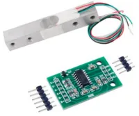
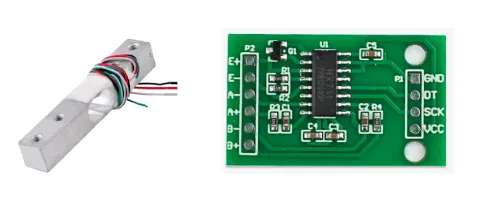
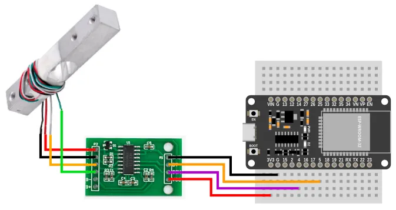
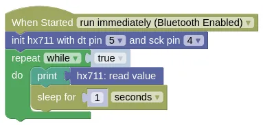

# HX711 (Analog-to-Digital, Load Cell)



The HX711 is a Analog-to-Digital converter, commonly used with load cells (...shown above) for weight / force measurement.

## Pins



| Pin | Description |
| --- | --- |
| VCC | Power for the sensor. Connect to **3V3**. If your device is on USB power, you can also use **VIN**. |
| GND | Ground pin. This should be connected to the **GND** pin on the ESP32. |
| DT | Data pin. This should be connected to an input capable pin on the ESP32 (default pin 5). |
| SCK | Serial Clock. This should be connected to an output capable pin on the ESP32 (default pin 4). |
| E+ | Connect to the Red wire on the load cell. |
| E- | Connect to the Black wire on the load cell. |
| A- | Connect to the White wire on the load cell. |
| A+ | Connect to the Green wire on the load cell. |

## Wiring



## Code

This code will print out measured value every 1 second.
It return a unitless value, so calibration is required if you want to measure weight.

### Blocks



### Python

```python
import hx711
import time

hx711_device = hx711.HX711(5, 4)
while True:
    print(hx711_device.read())
    time.sleep(1)
```

### Results

You should see in the monitor a value within the range −8,388,608 to 8,388,607 printed every second.

To convert this value to a weight reading, you'll need to calibrate it against a known weight.

# `class HX711` - read HX711 analog-to-digital converter

!!!!!
## Constructors

### hx711.HX711(dt_pin, sck_pin)

Creates a HX711 object.

The arguments are:

* `dt_pin` An integer specifying the microcontroller pin connected to DT.

* `sck_pin` An integer specifying the microcontroller pin connected to SCK.

Returns a `HX711` object.

## Methods

### HX711.read()

Reads from the HX711.

Returns an integer within the range −8,388,608 to 8,388,607 representing the unitless reading value.
!!!!!