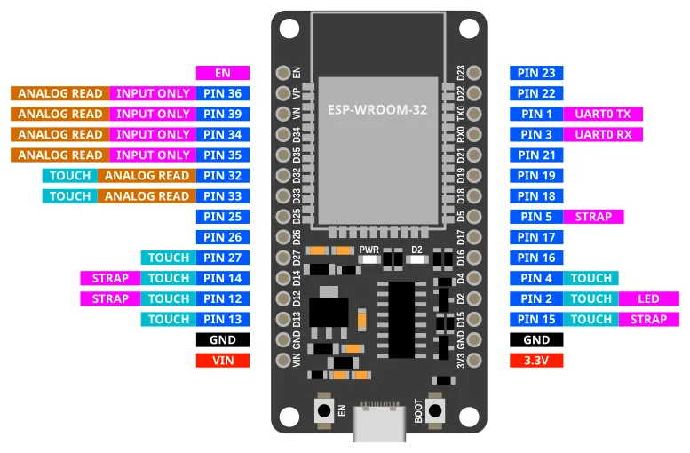
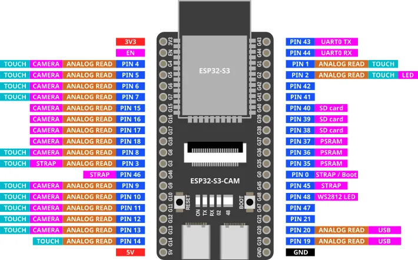
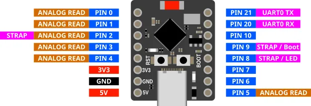

# Pinouts

## ESP32-WROOM

Most of the pins on the ESP32 can be used for inputs and outputs.
Exceptions are labelled above and described below.

| Label | Description |
| --- | --- |
| VIN | You can power the ESP32 by supplying 5V to 12V to this pin. If connected to USB, this pin will output 5V. |
| 3V3 | This pins outputs 3.3V. |
| GND | Ground pin. Both GND pins are the same, so you can use either. |
| INPUT ONLY | These pins can only be used as inputs. You cannot write to these pins. They also do not have internal pull-up resistors. |
| ANALOG READ | Only these pins can be used for analog read. |
| TOUCH | Only these pins can be used for touch read. |
| LED | This pin is connected to the onboard blue LED. |
| BOOT | This button is connected to Pin 0. Pin 0 will return a 0 (LOW) when the button is pressed, and 1 (HIGH) when it is not. |
| UART0 RX/TX | These pins are connected to the micropython terminal. You should not use them. |
| STRAP | These pins are generally ok to use as output, but they may output a signal during boot-up. |
| EN | This pin is connected to the EN (Reset) button. When connected to GND, the ESP32 will reset. |

## ESP32-S3-Cam (Freenove)

There are many varients of the ESP32-S3-Cam with different pinouts.
This is for the Freenove (...and clones) version.
Many of the pins have special uses, so check the table below before choosing a pin to use.

| Label | Description |
| --- | --- |
| 5V | You can power the ESP32 by supplying 5V to this pin. If connected to USB, this pin will output 5V. |
| 3V3 | This pins outputs 3.3V. |
| GND | Ground pin. |
| USB | These are used for the USB connection. You cannot use them. |
| PSRAM | These are used for the PSRAM (Pseudo-Static RAM). You cannot use them. |
| CAMERA | These are used for the camera. If you have a camera connected, you cannot use them. |
| SD card | These are used for the SD card. If you have a SD card plugged in, you cannot use them. |
| ANALOG READ | Only these pins can be used for analog read. |
| TOUCH | Only these pins can be used for touch read. |
| LED | This pin is connected to the onboard blue LED. |
| WS2812 LED | This pin is connected to the onboard WS2812 (Neopixel) LED. You can control it using the Neopixel extension. |
| BOOT | This button is connected to Pin 0. Pin 0 will return a 0 (LOW) when the button is pressed, and 1 (HIGH) when it is not. |
| UART0 RX/TX | These pins are connected to the micropython terminal. You should not use them. |
| STRAP | These pins are generally ok to use as output, but they may output a signal during boot-up. |
| EN | This pin is connected to the EN (Reset) button. When connected to GND, the ESP32 will reset. |

## ESP32-C3 Super Mini

| Label | Description |
| --- | --- |
| 5V | You can power the ESP32 by supplying 5V to this pin. If connected to USB, this pin will output 5V. |
| 3V3 | This pins outputs 3.3V. |
| GND | Ground pin. |
| ANALOG READ | Only these pins can be used for analog read. |
| TOUCH | None of the pins on the ESP32-C3 supports touch. |
| LED | This pin is connected to the onboard blue LED. |
| BOOT | This button is connected to Pin 9. Pin 9 will return a 0 (LOW) when the button is pressed, and 1 (HIGH) when it is not. |
| UART0 RX/TX | These pins are connected to the micropython terminal. You should not use them. |
| STRAP | These pins are generally ok to use as output, but they may output a signal during boot-up. |
