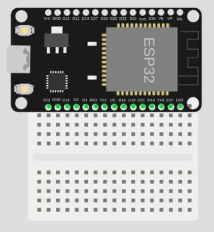
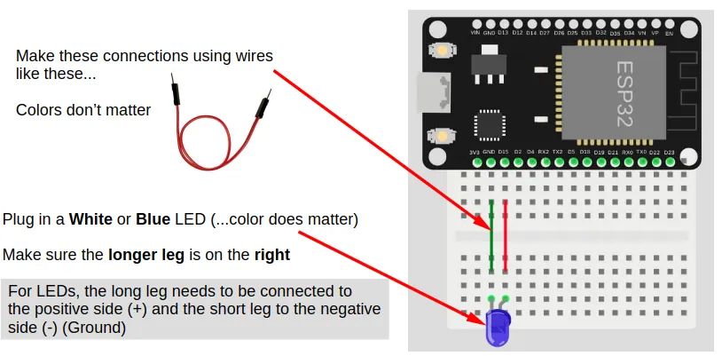
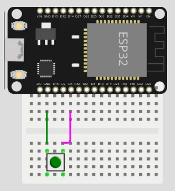
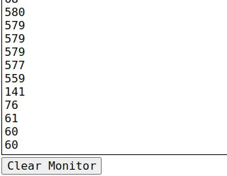

# GPIO Pins


Most of the pins on the ESP32 can be used for inputs and outputs.
Exceptions are labelled above and described below.

| Label | Description |
| --- | --- |
| VIN | You can power the ESP32 by supplying 5V to 12V to this pin. If connected to USB, this pin will output 5V. |
| 3V3 | This pins outputs 3.3V. |
| GND | Ground pin. Both GND pins are the same, so you can use either. |
| INPUT ONLY | These pins can only be used as inputs. You cannot write to these pins. They also do not have internal pull-up resistors. |
| ANALOG READ | Only these pins can be used for analog read. |
| TOUCH | Only these pins can be used for touch read. |
| LED | This pin is connected to the onboard blue LED. |
| BOOT | This button is connected to Pin 0. Pin 0 will return a 0 (LOW) when the button is pressed, and 1 (HIGH) when it is not. |
| UART0 RX/TX | These pins are connected to the micropython terminal. You should not use them. |
| STRAP | These pins are generally ok to use, but they may output a signal during boot-up. |
| EN | This pin is connected to the EN (Reset) button. When connected to GND, the ESP32 will reset. |

## Breadboard

Breadboards and dupont wires provides an easy way to connect components to your device.


When connecting your ESP32 to a breadboard, it is recommended to plug in only one side to each breadboard.
Like this...



If you need to use the other side as well, use a second breadboard.

## Digital Output (Write)

Writing a `1` to a pin will set it to `HIGH` (3.3V).
Writing a `0` to a pin will set it to `LOW` (0V).

### Wiring Example



If you do not have a suitable LED, you can use `Pin 2` instead.
`Pin 2` is connected to an internal Blue LED.

<div class="info">
The pins on the ESP32 outputs 3.3V. White and Blue LEDs works around that voltage, while most other colors requires a lower voltage (eg. 1.8V for Red). If you need to use a different color LED, you may need to add a resistor to reduce the voltage.
</div>

### Code

This example code turns the LED on/off every 1 second.

### Blocks


### Python

```python
import time
from ioty import pin

while True:
    pin.digital_write(15, 1)
    time.sleep(1)
    pin.digital_write(15, 0)
    time.sleep(1)
```

## Digital Input (Read)

Reading a pin will return `1` when it is `HIGH` (3.3V), and a `0` when it is `LOW` (0V).

It is often useful to enable the internal pull-up resistor when using a pin as an input; this will ensure that the pin is `HIGH` when it is not connected to anything, and `LOW` when connected to `GND`.
Without a pull-up resistor, the pin will be indetermined when not connected, and may give you random values.

### Wiring Example



If you do not have a suitable push button, you can used `Pin 0` instead.
`Pin 0` is connected to the `BOOT` button on the ESP32.

### Code

This example code turns the built-in LED (Pin 2) on when the button (...connected to Pin 4) is pressed, and off when it is released.

### Blocks


To add the `else` to an `if` block, use the gear icon.
You can use the same method to add an `else if` if you require it.

<video width="584" height="334" autoplay loop muted>
    <source src="images/ifElseElseif.mp4" type="video/mp4">
</video>

### Python

```python
from ioty import pin

pin.set_pin_mode(4, pin.PULL_UP)
while True:
    if pin.digital_read(4) == 0:
        pin.digital_write(2, 1)
    else:
        pin.digital_write(2, 0)
```

## Touch Input

Some of the pins on the ESP32 are capable of detecting capacitive touch.
This allows you to use these pins as buttons, by simply connecting a wire to the pin and touching the wire.

The values returned by the "touch read pin" block will tend to be high (...100s to over 1000) when there is no contact, and low (...less than 100) when there is contact.
The exact value will vary, and you'll need to test to determine it.

### Wiring Example


Note that the wire is not connected to anything; we'll be using the wire itself to detect touch.
To make a better touch button, you can connect the wire to an uninsulated paper clip or a piece of metal foil.

### Code (for testing)

We'll start with a simple code that displays the touch values.
This will let us know what values to expect when there is contact and no contact.

### Blocks (for testing)


### Python (for testing)

```python
import time
from ioty import pin

while True:
    print(pin.touch_read(4))
    time.sleep(1)
```

### Results (for testing)

Check the monitor for the results.
Touch the wire and see how the values change.



In this case, the values are around 500+ when there is no contact, and around 60-140 when there is contact.

### Code (as button)

Based on our test results, we can pick a number between the contact and no-contact values.
In this case, 300 would be roughly in the middle between the two ranges, but be warned that you may get a different value from me.

If the touch read value is below 300, we'll consider it to be touched, and turn on the Blue LED.
Else, we'll turn the LED off.
This is similar to the digital input exercise where we used a button, but here we are using a wire as a button.

### Blocks (as button)


### Python (as button)

```python
import time
from ioty import pin

while True:
    if pin.touch_read(4) < 300:
        pin.digital_write(2, 1)
    else:
        pin.digital_write(2, 0)
```

# `pin` - control GPIO pins

The `pin` object is meant to be easy to use, and do not provide all the capabilities available in micropython.
If you need more capabilities, you can use the `Pin` class provided by micropython [https://docs.micropython.org/en/latest/library/machine.Pin.html](https://docs.micropython.org/en/latest/library/machine.Pin.html).

Usage Model:

```python
from ioty import pin

# Set mode of pin 0 to input with pull-up
pin.set_pin_mode(0, pin.PULL_UP)

# Print the value of pin 0
print(pin.digital_read(0))

# Set pin 2 to 1 (HIGH)
pin.digital_write(2, 1)

# Print the analog value of pin 32 (0 to 65535)
print(pin.analog_read(32))

# Print the touch value of pin 4 (0 to ~1000)
print(pin.touch_read(4))

# Set the PWM frequency for pin 13
pin.set_analog_write_freq(13, 1000)

# Write the PWM value of 512 (around 50%) to pin 13
pin.analog_write(13, 512)

# Set the servo connected to pin 17 to 90 degrees
pin.servo_write_deg(17, 90)

# Print the distance measure by an ultrasonic sensor on pin 12 and 14
print(pin.hc_sr04_ping_cm(12, 14))
```

## Constructors

None.
Use the `pin` object directly.

## Methods

### pin.set_pin_mode(pin, mode)

This method allows you to set the pin mode.
The mode is set automatically when reading or writing to a pin, so this method isn't always required.
Automatic setting of mode will not use pull-ups, so pull-up should be set using this method if required.

The arguments are:

* `pin` An integer number specifying the pin number.

* `mode` The pin mode, which can be one of the following:
    * `pin.OUT` Set the pin to output mode.
    * `pin.IN` Set the pin to input mode without pull-up resistor.
    * `pin.PULL_UP` Set pin to input mode with pull-up resistor.

Returns `None``.

### pin.digital_read(pin)

This method gets the value from the pin.

The arguments are:

* `pin` An integer number specifying the pin number.

Returns either an integer `1` (HIGH) or `0` (LOW).

### pin.digital_write(pin, value)

This method sets the value of the pin.

The arguments are:

* `pin` An integer number specifying the pin number.
* `value` An integer `1` (HIGH) or `0` (LOW).

Returns `None`.

### pin.analog_read(pin)

This method gets an analog value from the pin.

The arguments are:

* `pin` An integer number specifying the pin number.

Returns an integer ranging from `0` to `65535`.

### pin.touch_read(pin)

This method gets a capacitive touch value from the pin.

The arguments are:

* `pin` An integer number specifying the pin number.

Returns an integer ranging from `0` to around `1000`.

### set_analog_write_freq(pin, freq)

This method sets the frequency for PWM output.

The arguments are:

* `pin` An integer number specifying the pin number.
* `freq` An integer ranging from `1` to `40000000` representing the frequency in Hz.

Returns `None`.

### pin.analog_write(pin, value)

This method sets the value of the pin.

The arguments are:

* `pin` An integer number specifying the pin number.
* `value` An integer ranging from `0` (0%) to `1023` (100%) representing the PWM duty cycle.

Returns `None`.

### pin.servo_write_deg(pin, deg)

This method sets a PWM signal on the specified pin suitable for controlling an RC servo.
The output PWM width will range from 500us (0 deg) to 2500us (180 deg).

The arguments are:

* `pin` An integer number specifying the pin number.
* `deg` An number (int/float) ranging from `0` to `180` representing the angle in degrees.

Returns `None`.

### pin.servo_write_us(pin, us)

This method sets a PWM signal on the specified pin suitable for controlling an RC servo.

The arguments are:

* `pin` An integer number specifying the pin number.
* `us` An number (int/float) representing the pulse width in microseconds.

Returns `None`.

### pin.hc_sr04_ping_cm(trig, echo, timeout=4000*2*3)

This method triggers a measurement on the ultrasonic distance sensor, and returns the measured distance in centimeters (cm).

The arguments are:

* `trig` An integer number specifying the pin connected to the TRIG of the ultrasonic. This must be an output capable pin.
* `echo` An integer number specifying the pin connected to the ECHO of the ultrasonic.
* `timeout` An integer representing the duration in microseconds to wait for the echo.

Returns `-1` on timeout, else it will return a float representing the measured distance in centimeters (cm).

### pin.hc_sr04_ping_us(trig, echo, timeout=4000*2*3)

This method triggers a measurement on the ultrasonic distance sensor, and returns the measured distance in microseconds (us).

The arguments are:

* `trig` An integer number specifying the pin connected to the TRIG of the ultrasonic. This must be an output capable pin.
* `echo` An integer number specifying the pin connected to the ECHO of the ultrasonic.
* `timeout` An integer representing the duration in microseconds to wait for the echo.

Returns `-1` on timeout, else it will return a integer representing the time for the echo to return in microseconds (us).
