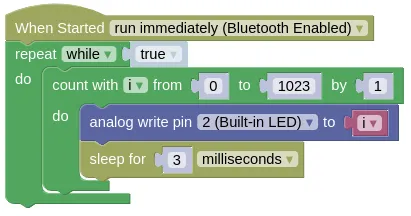

# Analog Read and Write

## Analog Write

The ESP32 can provide (...sort of) an analog output using PWM (Pulse Width Modulation).
What this means is the ESP32 will rapidly switch the pin on and off, and by changing the ratio of on-time vs off-time, it can vary the power output of the pin.

When performing an analog write, you need to provide a value ranging from 0 (fully off) to 1023 (full on).

| Value | Percentage |
| --- | --- |
| 0 | 0% |
| 256 | 25% |
| 512 | 50% |
| 767 | 75% |
| 1023 | 100% |

By default, analog writes will use a PWM frequency of 1000Hz (ie. it will switch on and off 1000 times per second).
You can change this using the "set analog frequency" block or `pin.set_analog_write_freq(2, 500)` in Python (...sets pin 2 to 500Hz).

### Code

This code will vary the brightness of the Blue LED from 0% to 100%.

### Blocks



### Python

```python
import time
from ioty import pin

while True:
    for i in range(1024):
        pin.analog_write(2, i)
        time.sleep_ms(3)
```

### Results

You should see the Blue LED slowly go from dim to bright, then dropping back to dim.

<div class="info">
The LED brightness will not appear to be changing linearly. That's because the way humans perceive brightness is not linear. A better approach would be to use an exponential function, but that's outside the scope of this tutorial.
</div>

## Analog Read

The ESP32 can measure voltages on Pins 32 to 39, and return a value ranging between 0 (0V) to 65535 (3.3V).

This can be used with a potentiometer to measure rotation, or a joystick to measure joystick position.

### Wiring


Most potentiometer will not have labels on their pins.
If you have such a potentiometer, connect the middle pin to Pin 32, the left pin to GND, and the right pin to 3V3.

### Code

This code will read the value from the potentiometer and print it to the Monitor.
The "sleep" is required to prevent your device from writing too rapidly to the Monitor (...which can cause your browser to become laggy).

### Blocks


### Python

```python
import time
from ioty import pin

while True:
    print(pin.analog_read(32))
    time.sleep(1)
```

### Results

You should see a number ranging from 0 to 65535 printed in the Monitor.
Turning the potentiometer will change this value.