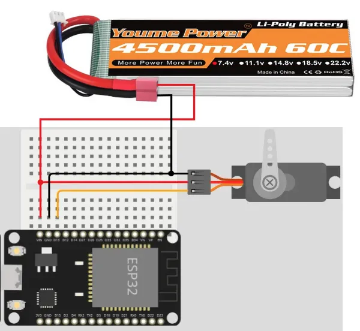
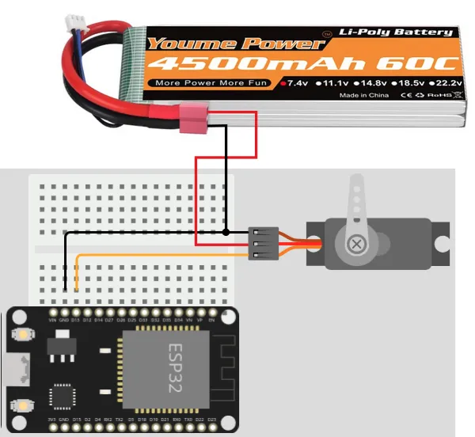
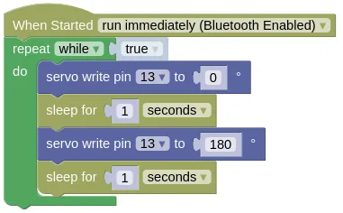

# Servo

The term **servo** refers to a device that uses feedback to correct its action.
For example, the rudders on a ship uses a servo to ensure that it turns to the correct angle ordered by the bridge.
Servos for the rudders of a ship can weigh more than a large truck, while servos for a remote control plane can be as light as a sheet of paper.

Here, the term **servo** refers to **Hobby servo** (aka **RC servo**).
These are small geared motors that can receive a signal, and based on the signal, rotate and stay at a particular angle.
Here are some examples of **Hobby servos**...


There are many different models of such servos, and they mainly differ in their size and torque.
Common features among these servos includes...

* Rotates between 0 to 180 degrees. (Exceptions exists, but are less common)
* Typically accepts power ranging from 4.8V to 7.2V.
* Controlled using the same type of signal.
* Uses 3 wires.

## Pins

Hobby servos usually have 3 wires.
These wires are color coded (Red, Black/Brown, Orange/Yellow/White/Blue) to indicate their purpose.

| Pin | Purpose |
| --- | --- |
| Red | Provides the servo with power. For one or two small servos, connect to **VIN** on the ESP32. |
| Black/Brown | Provides the servo with power. Connect to **GND** on the ESP32. |
| Orange/Yellow/White/Blue | Signal. This is used to tell the servo what angle to turn to. Connect to any of the output capable pins on the ESP32. |

## Power

There are a few options for powering your servo...

### ESP32 VIN Pin (USB power)

If your ESP32 is connected to USB power, you can power one or two small servos (...such as the SG90) using the VIN pin.
Connect the **Red** wire to the **VIN** pin and the **Black/Brown** wire to any of the **GND** pins.


You cannot use this method for larger servos or if you are using many servos; the **VIN** pin won't be able to supply enough current and may cause the ESP32 to reset or turn off.

### ESP32 VIN Pin (Parallel power)

If your ESP32 is being powered by a power supply that is around 7.2V or less, you can power both the ESP32 and servo in parallel.
Connect the **Red** wire to the **VIN** pin and the **Black/Brown** wire to any of the **GND** pins.



This method will provide the servo with the same voltage as the power supply, potentially allowing you to drive your servo at a higher voltage (...giving more speed and torque).
You can also draw a more current using this method.

### Separate Power

When the servos are heavily loaded, they can draw very large current, causing the battery voltage to dip.
This can cause the ESP32 to reset or turn off.

One way around this is to provide separate power supply for the servo and ESP32 (eg. USB power for ESP32 and a separate battery pack for the servo).
Connect the **Red** wire to the **positive** terminal of your power supply and the **Black/Brown** wire to the **negative** terminal.
Ensure that the **negative** terminal of the battery is also connected to the **GND** pin on the Arduino.



Using this method, you can power any number of motors of any size or voltage, without causing instability in the ESP32.

## Wiring

Regardless of the powering method used, the **signal** wire (Orange/Yellow/White/Blue) should be connected to an output capable pin on the ESP32.
In this example, we are using Pin 13.

## Code

This code will change the servo angle from 0 to 180 degrees and back.

### Blocks



### Python

```python
import time
from ioty import pin

while True:
    pin.servo_write_deg(13, 0)
    time.sleep(1)
    pin.servo_write_deg(13, 180)
    time.sleep(1)
```

### Results

You should see the servo turn from 0 to 180 degrees and back.
Depending on the model of your servo, you may find it turning less or more than 180 degrees; different servo models interpretes the servo command signal differently.