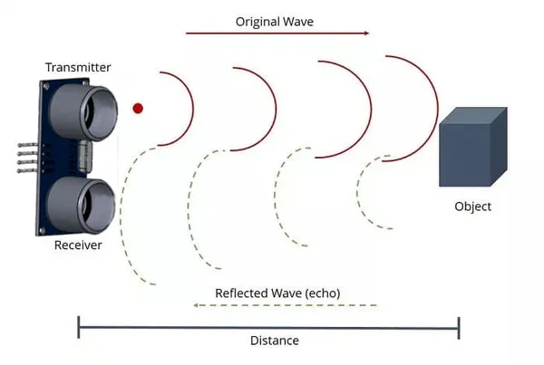

# Ultrasonic Distance (HC-SR04)


The HC-SR04 Ultrasonic Distance Sensor works by sending a pulse of sound and measuring how long it takes for the echo to return.



Features of this sensor includes...

* Max Range: 400cm
* Detects in a cone
* Cannot detect small objects far from the sensor-
* Multiple sensors may interfere with each other

## Pins

| Pin | Purpose |
| --- | --- |
| VCC | Provides the ultrasonic with power. Connect to **VIN** on the ESP32. |
| GND | Provides the ultrasonic with power. Connect to **GND** on the ESP32. |
| TRIG | Triggers the start of a distance measurement. Connect to any output capable pin. |
| ECHO | Provides the return signal for distance measurement. Connect to any IO pin. |

## Wiring

In this example, we are using Pin 12 for TRIG and Pin 14 for ECHO.
If you use different pins, change your code accordingly.


## Code

This code will change the servo angle from 0 to 180 degrees and back.

### Blocks


### Python

```python
import time
from ioty import pin

while True:
    print(pin.hc_sr04_ping_cm(12, 14))
    time.sleep(1)
```

### Results

You should see a distance in cm printed in the monitor.
If you place an object in front of the ultrasonic, you should see the distance change.


