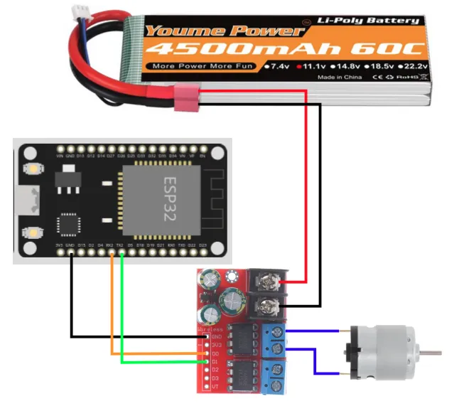
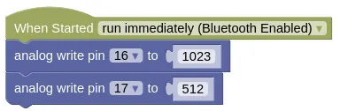
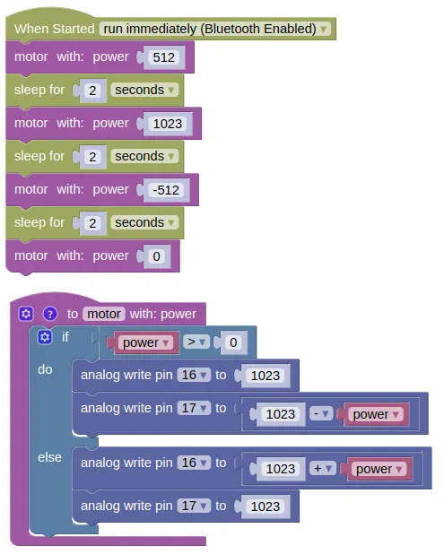
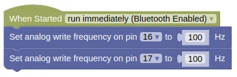

# Controlling a H-Bridge (2 pins)

## Two Pins or Three Pins

Most H-Bridge motor driver boards uses either **2 pins or 3 pins** to control each motor.

We'll be using the TA6586 motor driver which uses 2 pins in the below example.
If you have a different motor driver board that also uses 2 pins, you can use the same code and it should work fine.

## TA6586

We will be using the TA6586 motor driver for this part of the course, but many other h-bridge drivers work similarly.


This motor driver board contains two H-Bridges, making it suitable for controlling **two motors** with just one board.
It support voltages of **3 to 14V** and up to **5A** of current.

## Pins

| Pin | Description |
| --- | --- |
| Black Screw Terminals | Power supply for the board and motors. Polarity (+/-) is printed on the bottom of the board. Must not be reversed. |
| Blue Screw Terminals x 2 | Connection for the motors. There are two pairs of terminals for two separate motors. |
| Gnd | Ground pin. This should be connected to the **GND** pin on the microcontroller. |
| 3V3 | This provides a 3.3V supply that can be used for powering external components such as the micro-controller. If you don't require 3.3V, you can just leave this unconnected. |
| D0 & D1 | Controls the first motor. Motor will turn if one pin is high and the other is low. If both are high or both are low, the motor will not turn. |
| D2 & D3 | Controls the second motor. Motor will turn if one pin is high and the other is low. If both are high or both are low, the motor will not turn. |
| VT | Not used. Ignore. |

## Wiring

Connect your battery, motor driver board, and motor as follows.



<div class="important">
In the diagram above, the battery is only supplying power to the motor driver board, not the ESP32.
If the ESP32 is connected to your computer via the USB cable, that will provide it with power.
Else, you can connect the + side of the battery to the <strong>VIN</strong> pin.
</div>

<div class="info">
In the diagram above, we are using pin 16 and 17 to control the motor driver.
You can use any pins as long as they are output capable.
</div>

## Code

We'll be programming the H-Bridge to operate in [Sign Magnitude Drive](https://www.modularcircuits.com/blog/articles/h-bridge-secrets/sign-magnitude-drive/) mode.
What that means is pretty complicated, and you can read the linked article if you're interested to understand more.

### Blocks



### Python

```python
from ioty import pin

pin.analog_write(16, 1023)
pin.analog_write(17, 512)
```

## Speed Control

Try changing the value of pin 17 to 255 (...around 25%).
Did the motor turn faster or slower?
Try 768 (...around 75%).
What did you observe?

By now you should have noticed that the relationship between power and speed are reversed.
The higher the power, the lower the speed.
That's a result of how Sign Magnitude Drive works.

## Direction Control

Change the code to set pin 17 at 1023 and reduce pin 16 to 512.
You should see the motor turning in the opposite direction from before.

## Motor Control Function

It's useful to build a function to control the motor.
Try the following code.

### Blocks

Create a new function like this...

<video width="660" height="446" autoplay loop muted>
    <source src="images/createFunction.mp4" type="video/mp4">
</video>

Then fill in the following code...



### Python

```python
import time
from ioty import pin

def motor(power):
    if power > 0:
        pin.analog_write(16, 1023)
        pin.analog_write(17, (1023 - power))
    else:
        pin.analog_write(16, (1023 + power))
        pin.analog_write(17, 1023)

motor(512)
time.sleep(2)
motor(1023)
time.sleep(2)
motor(-512)
time.sleep(2)
motor(0)
```

### Results

You should see your motor run...

* Forward at half speed for 2 seconds
* Forward at full speed for 2 seconds
* Reverse at half speed for 2 seconds
* Stop

If the motor direction is wrong, swap the pin numbers.

## Speed or Power?

While I may talk about full speed and half speed, what we are actually controlling is the **power** and not the **speed**.
To actually control the speed of the motor, we'll need to add additional sensors (eg. motor encoders) and a control loop to regulate the motor speed.

Thankfully, the motor speed is largely proportional to the motor power, so controlling power isn't too terrible an option.
But note that depending on load and battery level, the actual speed may vary.

## Low Power Caveat

While the motor speed is largely proportional to motor power, this approximation falls apart at low power / duty cycle and you may find your motors performing very inaccurately or even stop completely.
Depending on your hardware and PWM frequency, this low power limit can be anywhere from 10% to 50%.
If you find that you are unable to achieve a sufficiently low speed, reducing your PWM frequency can help.



```python
from ioty import pin

pin.set_analog_write_freq(16, 100)
pin.set_analog_write_freq(17, 100)
```

This should improve low speed performance, at the expense of more noise and vibration.