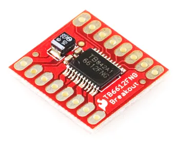

# Controlling a H-Bridge (3 pins)

## Two Pins or Three Pins

Most H-Bridge motor driver boards uses either **2 pins or 3 pins** to control each motor.

We'll be using the TB6612 motor driver which uses 3 pins in the below example.
If you have a different motor driver board that also uses 3 pins, you can use the same code and it should work fine.

## TB6612

We will be using the TB6612 motor driver for this part of the course, but many other h-bridge drivers work similarly.



This motor driver board contains two H-Bridges, making it suitable for controlling **two motors** with just one board.
It support voltages of **4.5 to 13.5V** and up to **1.2A** of current.

## Pins

| Pin | Description |
| --- | --- |
| VM | Power for the motors (+ terminal). |
| VCC | Power for the board (2.7V to 5.5V). |
| GND | Ground. This is common for both the board power and motor power. All ground pins are the same. |
| STBY | This needs to be pulled high for the board to work. You can pull it high using an IO pin or by simply connecting it to the 3V3 pin. |
| A01/A02 | Output A. Connect this to a motor. |
| B01/B02 | Output B. Connect this to a motor. |
| AI1/AI2 | Input for motor A. This controls the direction of the motor. |
| BI1/BI2 | Input for motor B. This controls the direction of the motor. |
| PWMA/PWMB | Controls the speed for motor A and B. |

## Wiring

Connect your battery, motor driver board, and motor as follows.


<div class="important">
In the diagram above, the battery is only supplying power to the motor driver board, not the ESP32.
If the ESP32 is connected to your computer via the USB cable, that will provide it with power.
Else, you can connect the + side of the battery to the <strong>VIN</strong> pin.
</div>

<div class="info">
In the diagram above, we are using pin 16 and 17 to control the direction of the motor, and pin 5 to control the speed.
You can use any pins as long as they are output capable.
</div>

## Code

By setting pin 16 to `1` and pin 17 to `0`, we can set the motor to turn in one direction.
Changing this to `0` and `1` will switch it to the opposite direction.

Setting both to `1` will put the motor in **Brake** mode (...stops rapidly).
Setting both to `0` will put the motor in **Coast** mode (...stops gradually).

The speed of the motor is controlled by setting the analog value on pin 5.

### Blocks


### Python

```python
from ioty import pin

pin.digital_write(16, 1)
pin.digital_write(17, 0)
pin.analog_write(5, 512)
```

## Motor Control Function

It's useful to build a function to control the motor.
Try the following code.

### Blocks

Create a new function like this...

<video width="660" height="446" autoplay loop muted>
    <source src="images/createFunction.mp4" type="video/mp4">
</video>

Then fill in the following code...


### Python

```python
import time
from ioty import pin

def motor(power):
    if power > 0:
        pin.digital_write(16, 1)
        pin.digital_write(17, 0)
        pin.analog_write(5, power)
    else:
        pin.digital_write(16, 0)
        pin.digital_write(17, 1)
        pin.analog_write(5, -power)

motor(512)
time.sleep(2)
motor(1023)
time.sleep(2)
motor(-512)
time.sleep(2)
motor(0)
```

### Results

You should see your motor run...

* Forward at half speed for 2 seconds
* Forward at full speed for 2 seconds
* Reverse at half speed for 2 seconds
* Stop

If the motor direction is wrong, swap the pin numbers.

## Speed or Power?

While I may talk about full speed and half speed, what we are actually controlling is the **power** and not the **speed**.
To actually control the speed of the motor, we'll need to add additional sensors (eg. motor encoders) and a control loop to regulate the motor speed.

Thankfully, the motor speed is largely proportional to the motor power, so controlling power isn't too terrible an option.
But note that depending on load and battery level, the actual speed may vary.

## Low Power Caveat

While the motor speed is largely proportional to motor power, this approximation falls apart at low power / duty cycle and you may find your motors performing very inaccurately or even stop completely.
Depending on your hardware and PWM frequency, this low power limit can be anywhere from 10% to 50%.
If you find that you are unable to achieve a sufficiently low speed, reducing your PWM frequency can help.


```python
from ioty import pin

pin.set_analog_write_freq(5, 100)
```

This should improve low speed performance, at the expense of more noise and vibration.