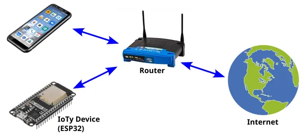
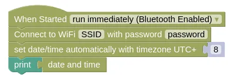
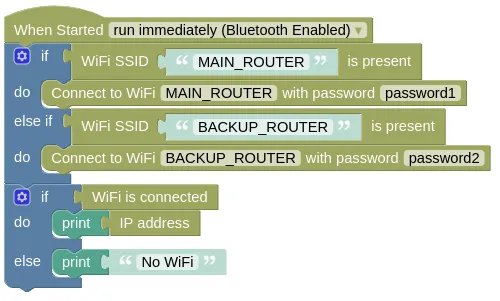
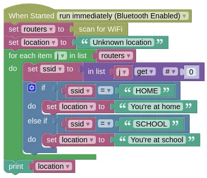

# Client Mode



In Client Mode (aka. Station Mode), your IoTy device will connect to a WiFi router.

<div class="important">
Some WiFi networks requires you to open a webpage and sign in after connection (...common with free WiFi at hotels, coffee shops, airports, etc). These are called captive portals and they won't work with your IoTy device.
</div>

Your device will have internet access (...provided your router is connected to the internet), and will be able to...

* Retrieve webpages and data (see urequest extension)
* Connect to an MQTT broker (see the MQTT page for more info)
* Act as a webserver (see EZ HTTPD extension)

<div class="important">
To act as a webserver, the router must allow incoming connections to your IoTy device. Not all routers will allow this. Home routers usually allows it by default, public routers and phone hotspots usually do not.
</div>

## Basic Connection

This example connects to WiFi, retrieves the date/time, and prints it out.
You must put in your actual WiFi SSID and password or this will not work.

### Blocks



Note that the `set date/time` block is under the `Control` category.

### Python

```python
import ioty.wifi
import ntptime
import machine

ioty.wifi.connect('SSID', 'password') # Put in actual WiFi SSID/Password

# Retrieves the UTC time from the internet and set your device clock to it
ntptime.settime()

# Retrieve the time, add 8 hours, and set it back.
# This changes the time from UTC to UTC+8
# UTC+8 is the timezone here in Singapore; change if you live somewhere else.
dateTime = list(machine.RTC().datetime())
dateTime[4] += 8
machine.RTC().datetime(dateTime)

# Prints the date/time
print(machine.RTC().datetime())
```

<div class="tip">
<code>ntptime.settime()</code> may fail due to network conditions, and will throw an exception is such cases. It's best to put it in a <code>try except</code> to handle such failures.
</div>

## Multiple Routers

You may want to use your device at home (...using home router), and outside (...using phone hotspot).
In such cases, you can first check which router is present, before trying to connect to it.

This example demonstrates checking for the presence of two different routers, before connecting and printing the assigned IP address.

### Blocks



### Python

```python
import ioty.wifi
import ntptime
import machine

routers = [
    ['MAIN_ROUTER', 'password1'],
    ['BACKUP_ROUTER', 'password2']
]

for router in routers:
    if ioty.wifi.is_present(router[0]):
        ioty.wifi.connect(router[0], router[1])

if ioty.wifi.isconnected():
    print(ioty.wifi.get_ip())
else:
    print('No WiFi')
```

<div class="info">
The Python example uses a list and a loop, and is implemented quite differently from the Blocks example. The end result is however the same.
</div>

## Scanning for WiFi

Even without connecting to a router, simply scanning for the available WiFi can provide a rough indication of your device location (ie. at home or at school).

This example scans for WiFi, checks for the presence of the "HOME" router and "SCHOOL" router, and prints its approximate location.

### Blocks



## Python

```python
import ioty.wifi

routers = ioty.wifi.scan()
location = 'Unknown location'
for j in routers:
    ssid = j[0]
    if ssid == 'HOME':
        location = "You're at home"
    elif ssid == 'SCHOOL':
        location = "You're at school"
print(location)
```

<div class="tip">
At large facilities such as a school, you may see the same SSID available throughout the entire area. These are actually multiple routers, all set to the same SSID. You can differentiate between them through their BSSID. This can be useful to determine your location within the facility, but it may take some work to compile the list of BSSID.
</div>