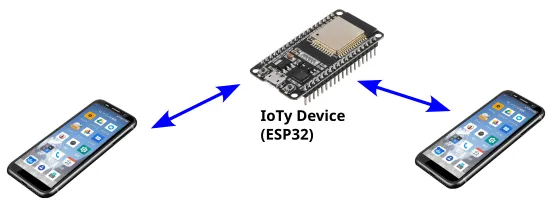
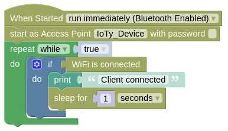

# Access Point Mode



In Access Point Mode (aka. Router Mode), your IoTy device will behave like a WiFi router.
You can then connect your phones and computers to your IoTy device.

<div class="important">
While connected to your IoTy device, your phone / computer will lose internet access.
</div>

In Access Point Mode, your IoTy device will not be connected to the internet, so you cannot use MQTT or retrieve webpages.
Your device can however act as a webserver (see EZ HTTPD extension), which you can then access using your phone / computer.

<div class="important">
Some devices (eg. iPhones) will refuse to use the WiFi connection provided by your IoTy device when it detects that internet access is not available through it. Instead, it will continue to use mobile data. To force it to use the WiFi connection, you must disable mobile data.
</div>

## Basic Access Point Setup

This example starts your IoTy device as an open (...no password) access point.
You'll be able to find it using your phone / computer and connect to it.

Upon connection, your device should print "Client connected" to the monitor.

<div class="info">
If you want to, you can set a password for your access point. Note that the password for WiFi access points must have at least 8 characters.
</div>

### Blocks



### Python

```python
import ioty.wifi
import time

ioty.wifi.start_ap('IoTy_Device', '')
while True:
    if ioty.wifi.isconnected():
        print('Client connected')
        time.sleep(1)
```