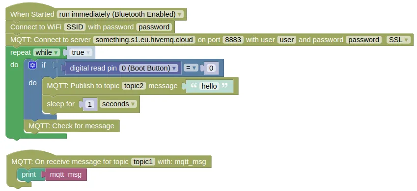

# MQTT

MQTT is a lightweight publish and subscribe network protocol.
It's commonly used for Internet-of-Things (IoT) devices due to its low resource requirements.


MQTT can be used to send messages between two IoTy devices, or between IoTy devices and a phone / computer.
IoTy provides an MQTT App Builder (...find it under "App -> MQTT App Builder") that you can use to build an interactive webapp that can communicate with your IoTy device.

## Brokers

To use MQTT, you need to have an MQTT broker.
If you have a server, you can install your own broker (eg. [Mosquitto](https://mosquitto.org/)).
Alternatively, you can use a cloud based broker (eg. [HiveMQ Cloud](https://docs.hivemq.com/hivemq-cloud/quick-start-guide.html), the Free Serverless plan will do fine).

## Publish and Subscribe

In MQTT, each client can subscribe to one or more topic.
[Topic names](https://www.hivemq.com/blog/mqtt-essentials-part-5-mqtt-topics-best-practices/) can be any string, and need not be created in advanced.
After subscription, the client will receive any messages that are published to that topic.

<div class="important">
You must run <code>Check for message</code> or in Python, <code>check_msg()</code>, frequently. You will not receive any messages if you do not run this.
</div>

A client can also publish to a topic.
Published messages will be sent to all subscriber clients.
By default, a message for publishing should be a bytes object, but IoTy also provide Blocks that automatically convert strings to a bytes object.

<div class="tip">
If you need to send complex data (eg. list) via MQTT, you can use the <code>json dump string</code> block or in Python, <code>json.dumps()</code>.
This will convert your data (eg. list, dictionary) to a string format that you can send via MQTT. The recepient will need to use <code>json load string</code> or in Python, <code>json.loads()</code>, to convert it back.
</div>

## MQTT App Builder

In IoTy, click on "App -> MQTT App Builder" to open the app builder page.

Connect to an MQTT broker by clicking "3 dots menu -> Connect".
Fill in the host name (...make sure it ends with "/mqtt"), username, and password.

<div class="info">
If you don't have a broker, you can obtain a free one from HiveMQ. Follow the instructions <a href="https://docs.hivemq.com/hivemq-cloud/quick-start-guide.html">here</a>.
</div>

Add a Switch and a Display.
Set their topics.
Click the "Run" button.

<video width="692" height="582" autoplay loop muted>
    <source src="images/mqttApp_addWidgets.mp4" type="video/mp4">
</video>

## Code

### Blocks

Create the following program.
Make sure to put in your actual WiFi SSID and password.
You also need to put in your actual MQTT broker URL, username, and password.



### Python

```python
import ioty.wifi
from umqtt.robust import MQTTClient
import machine
import ubinascii
import time
from ioty import pin

# MQTT callback for topic topic1
def ioty_mqtt_cb_topic1(mqtt_msg):
    print(mqtt_msg)

ioty.wifi.connect('SSID', 'password') # Put in actual WiFi SSID/Password

# MQTT callback
def ioty_mqtt_cb(topic, msg):
    if topic == b'topic1':
        print(msg.decode()) # decode converts bytes to string

client_id = ubinascii.hexlify(machine.unique_id()) # Creates a client ID from machine ID.
# Alternatively, you can just use any string as client_id, as long as it is unique.

# Connect to MQTT server. Put in the actual URL, username, and password
ioty_mqtt = MQTTClient(
    client_id,
    'something.s1.eu.hivemq.cloud',
    port=8883,
    user='user',
    password='password',
    keepalive=60,
    ssl=True,
    ssl_params={'server_hostname':'something.s1.eu.hivemq.cloud'}
)
ioty_mqtt.set_callback(ioty_mqtt_cb)
ioty_mqtt.connect()
ioty_mqtt.subscribe(b'topic1')

while True:
    if pin.digital_read(0) == 0:
        ioty_mqtt.publish(b'topic2', bytes('hello', 'utf-8')) # bytes converts string to bytes
        time.sleep(1)
    ioty_mqtt.check_msg() # Run this frequently or you will not receive messages
```

## Results

In the MQTT App Builder, click the Switch Widget.
You should see the message "on" or "off" printed in the IoTy monitor.

Press the boot button on your ESP32.
You should see the message "hello" appear in the Display Widget on the MQTT App Builder.