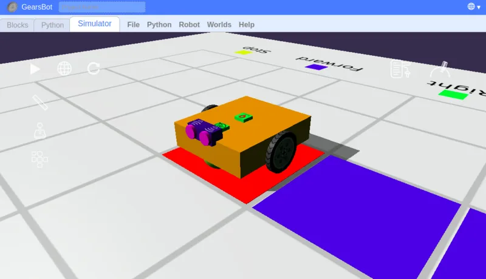

# Course Overview

To load this course you can navigate to:

## http://a9i.sg/p1

In this course, you will...

* Learn about Computational Thinking
* Understand how we can use Computational Thinking to solve everyday problems
* Apply Computational Thinking to solve robotics challenges

