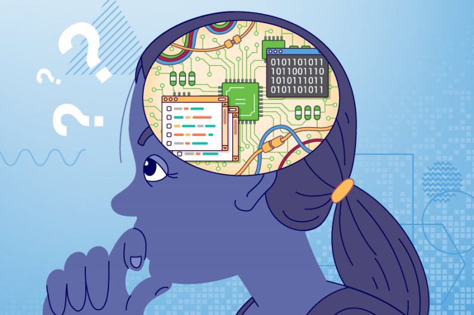

Computational Thinking
---

This program is built around the idea of Computational Thinking, which is a 21st Century Competency buzz phrase all students must recognize!

But what does it mean?

## What is Computational Thinking?

Computational Thinking is **NOT**...

* ...about thinking like a computer (...computers don't think very well...)
* ...only for programmers (...everyone can use it)
* ...only for for school and work (...it's useful even for things like planning a party)

**Computational Thinking is about figuring out how to solve problems!**

## Where did Computational Thinking come from?

When people want create games and apps, they need program the computer to tell it what to do.
But this can be hard, because while computers can think very fast, they are not very smart.

**The Computational Thinking method was created to help programmers figure out how solve programming problems.**

At some point, people figured out that the Computational Thinking method can also be used to solve other types of hard problems, like...

* ...packing your bag
* ...searching for lost keys
* ...building a rocket
