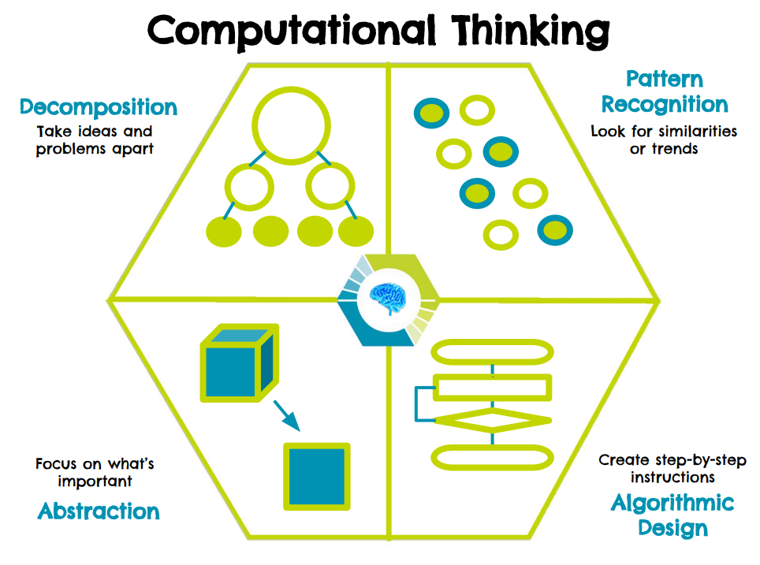

# Four Computational Thinking Skills

Computational Thinking consists of four skills...

 

## Decomposition

Breaking down complex problems into smaller pieces.

## Pattern Recognition

Noticing when things are alike or very different.

## Abstraction

Ignoring details that are not important to our problem.

## Algorithmic Design

Creating a step-by-step solution to the problem.

We use these skills every day, but we don't necessarily know we are doing it.
Let's look at an example...
