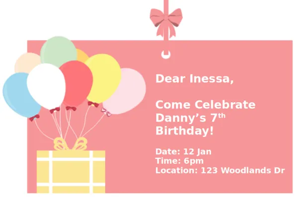
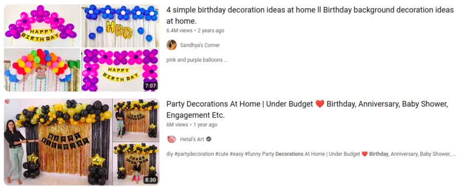
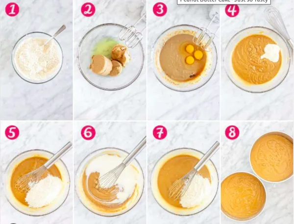

# Planning a Birthday Party

## Step 1 (Decomposition)

Write down what needs to be done.

* Send invitation
* Decorate house
* Bake a cake

## Step 2 (Pattern Recognition)

Take a look at the birthday invitation...

...which parts are the same for every invite?
How can we make use of this similarity to make our work easier?

## Step 3 (Abstraction)

Let's look for some decorating ideas from YouTube...

Those looks great!
But my house don't look the same as the ones in the video (different types of curtains, tables, chairs, etc).
Can I still use the ideas from the videos?
Which parts of the videos are important and which are not?

## Step 4 (Algorithmic Design)

What are the steps to bake a cake?

Can you come up with your own steps to bake a cake?

We will come back to these idea, when we discuss different activities in coding and designing our robot!