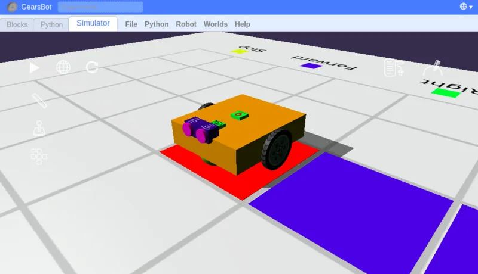

The GearsBot App
---

For our programming exercises, we will be using the [GearsBot app](https://gears.aposteriori.com.sg/).

GearsBot is a free and open-source software for robotics simulation.
It uses blocks based programming that is very similar to what professional programmers use, but with less typing.

We will be programming our robot to solve some challenges, and we will make use of Computational Thinking to figure out what instructions to give our robot.