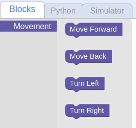
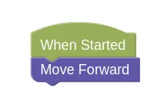
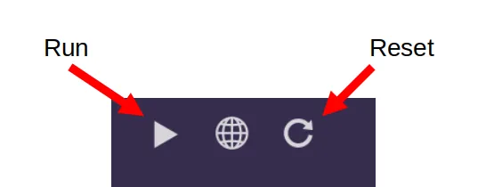
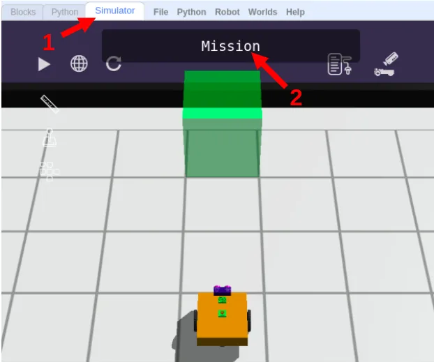

# Sequences

Let's find out about Sequential programs in [GearsBot](https://quirkycort.github.io/gears/public/index.html?worldJSON=https%3A%2F%2Ffiles.aposteriori.com.sg%2Fget%2F8hJAhhRWox.json&robotJSON=https%3A%2F%2Ffiles.aposteriori.com.sg%2Fget%2FygcmWx4oSE.json&filterBlocksJSON=https%3A%2F%2Ffiles.aposteriori.com.sg%2Fget%2FqWMgNrD6Bu.json&worldScripts=world_challenges).

## Blocks Tab

Navigate to the Blocks tab.
Right now, you only have one category of blocks; **Movement**.

As you progress through the lessons, we will add more categories for you to use.

You can drag and drop blocks from those panels into the coding canvas.

## When Started

The main program will start executing code from the **When Started** event.  When you press the **Run** button in the simulator, this is where the robot code begins.

## Statements

The fundamental unit of a code is an execution **statement**.

Do this.

Do that.

When we program a bunch of these statements one after the other, the hub will execute them in the same order.

This is called a **sequence**, meaning one statement follows another.

## Sequences

Let's try some simple code sequences.

First, let's make the robot move forward.

### Robot Movement

Find the **Movement** tab, and look at the choices...

### Forward

Let's make the robot move 1 block forward.

Drag a `Move Forward` block, and place it below `When Started`:

Now switch to the **Simulation** tab and click **Run**.

Your robot should move forward.

## Challenges

Now we have a series of challenges for you to try out.

For each challenge, click on the *Simulator Tab*, then the *Mission* button to see the mission you need to do.

Follow instructions and note down the *special Code* after doing the challenge successfully!

### Challenge 1

- Load [this challenge](https://quirkycort.github.io/gears/public/index.html?worldJSON=https%3A%2F%2Ffiles.aposteriori.com.sg%2Fget%2FB9GeeMU54M.json&filterBlocksJSON=https%3A%2F%2Ffiles.aposteriori.com.sg%2Fget%2FYaRSZ9WSdZ.json&worldScripts=challenges_basic)

- This first one is simple; you just need to move forward.

### Challenge 2

- Load [this challenge](https://quirkycort.github.io/gears/public/index.html?worldJSON=https%3A%2F%2Ffiles.aposteriori.com.sg%2Fget%2FFRe4MNv576.json&filterBlocksJSON=https%3A%2F%2Ffiles.aposteriori.com.sg%2Fget%2FYaRSZ9WSdZ.json&worldScripts=challenges_basic)

- What if happens if you put it multiple `Move Forward` blocks?
