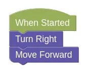

# Turning

If we want the robot to move to the right, we'll need to tell it to turn right first.

Drag a `Turn Right` block, and place it between `When Started` and `Move Forward`.

Your robot will now turn right, before moving forward.

Naturally, if you want your robot to turn left, you should use a `Turn Left` block.

## Challenges

Now we have a series of challenges for you to try out.

For each challenge, click on the *Simulator Tab*, then the *Mission* button to see the mission you need to do.

Follow instructions and note down the *special Code* after doing the challenge successfully!

### Challenge 3

- Load [this challenge](https://quirkycort.github.io/gears/public/index.html?worldJSON=https%3A%2F%2Ffiles.aposteriori.com.sg%2Fget%2F7t6pDTcxTE.json&filterBlocksJSON=https%3A%2F%2Ffiles.aposteriori.com.sg%2Fget%2FYaRSZ9WSdZ.json&worldScripts=challenges_basic)

### Challenge 4

- Load [this challenge](https://quirkycort.github.io/gears/public/index.html?worldJSON=https%3A%2F%2Ffiles.aposteriori.com.sg%2Fget%2FYZ9T9nQiyQ.json&filterBlocksJSON=https%3A%2F%2Ffiles.aposteriori.com.sg%2Fget%2FYaRSZ9WSdZ.json&worldScripts=challenges_basic)

### Challenge 5

- Load [this challenge](https://quirkycort.github.io/gears/public/index.html?worldJSON=https%3A%2F%2Ffiles.aposteriori.com.sg%2Fget%2FbuFoQBqPTS.json&filterBlocksJSON=https%3A%2F%2Ffiles.aposteriori.com.sg%2Fget%2FYaRSZ9WSdZ.json&worldScripts=challenges_basic)
