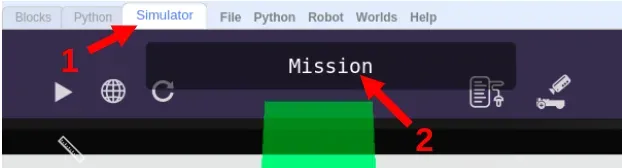

# Pause, Sleep, Rest

Sequential programs sometimes require that your robot take a break, pausing for some other actions.

It's like standing at a red light.

In order to tell your robot to take a break, you need to pause the sequential operation for some time.

## Sleep Block

The *Sleep Block* under the *Control* Blocks category will do just that.

# Challenges

Now we have a series of challenges for you to try out.

For each challenge, click on the *Simulator Tab*, then the *Mission* button to see the mission you need to do.

Follow instructions and note down the *special Code* after doing the challenge successfully!

### Challenge 6

- Load [this challenge](https://gears.aposteriori.com.sg/index.html?worldJSON=https%3A%2F%2Ffiles.aposteriori.com.sg%2Fget%2F5CrxL43maK.json&filterBlocksJSON=https%3A%2F%2Ffiles.aposteriori.com.sg%2Fget%2FYaRSZ9WSdZ.json&worldScripts=challenges_basic)

- For this mission, you'll need to stop inside each box for a second before moving to the next.

### Challenge 7

- Load [this challenge](https://gears.aposteriori.com.sg/index.html?worldJSON=https%3A%2F%2Ffiles.aposteriori.com.sg%2Fget%2FhcMjhQe3oo.json&filterBlocksJSON=https%3A%2F%2Ffiles.aposteriori.com.sg%2Fget%2FYaRSZ9WSdZ.json&worldScripts=challenges_basic)

- For this mission, you'll need to stop inside each box for a second before moving to the next.