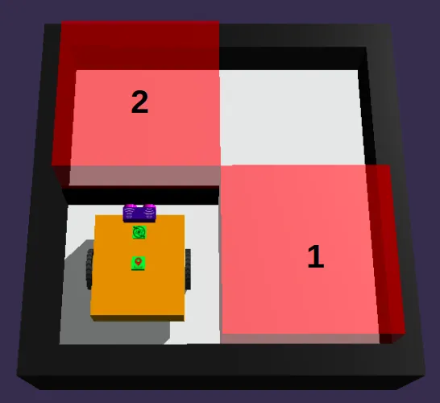
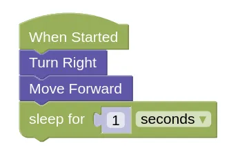

# Maze Challenges

Try using **Decomposition** to solve these maze challenges!

## Example 1

This challenge will be opened in a new tab.
Open it, take a look, then switch back to this page.

<a href="https://gears.aposteriori.com.sg/index.html?worldJSON=https%3A%2F%2Ffiles.aposteriori.com.sg%2Fget%2FLtJVJrMftN.json&filterBlocksJSON=https%3A%2F%2Ffiles.aposteriori.com.sg%2Fget%2FYaRSZ9WSdZ.json&worldScripts=challenges_basic" target="_blank">Open Challenge</a>

### Decompose

To solve this maze, we'll need to visit...

1. Red Box 1
2. Red Box 2

Your robot will need to stop for 1 second inside each box!

Let's decompose step 1 a little more...

1. Red Box 1
    1. **Turn Right**
    2. **Move Forward**
    3. **Stop for 1 second**
2. Red Box 2

Let's write the code for that...

Try out the code!

Now we'll decompose step 2...

1. Red Box 1
    1. Turn Right
    2. Move Forward 2
    3. Stop for 1 second
2. Red Box 2
    1. **Turn Left**
    2. **Move Forward**
    3. **Turn Left**
    4. **Move Forward**
    5. **Stop for 1 second**

Now it is your turn to code.
Add on to your previous code to complete the maze!

## Challenges

Now we have a series of challenges for you to try out.

For each challenge, click on the *Simulator Tab*, then the *Mission* button to see the mission you need to do.

Follow instructions and note down the *special Code* after doing the challenge successfully!

### Maze Challenge 1

- Load [this challenge](https://gears.aposteriori.com.sg/index.html?worldJSON=https%3A%2F%2Ffiles.aposteriori.com.sg%2Fget%2FeAUDpJ3KFE.json&filterBlocksJSON=https%3A%2F%2Ffiles.aposteriori.com.sg%2Fget%2FYaRSZ9WSdZ.json&worldScripts=challenges_basic)

### Maze Challenge 2

- Load [this challenge](https://gears.aposteriori.com.sg/index.html?worldJSON=https%3A%2F%2Ffiles.aposteriori.com.sg%2Fget%2FvPVXEUs2NZ.json&filterBlocksJSON=https%3A%2F%2Ffiles.aposteriori.com.sg%2Fget%2FYaRSZ9WSdZ.json&worldScripts=challenges_basic)

- This one is larger than the maze in the example, and it has 3 boxes that you need to visit.

### Maze Challenge 3

- Load [this challenge](https://gears.aposteriori.com.sg/index.html?worldJSON=https%3A%2F%2Ffiles.aposteriori.com.sg%2Fget%2FUnrvNWB5Nj.json&filterBlocksJSON=https%3A%2F%2Ffiles.aposteriori.com.sg%2Fget%2FYaRSZ9WSdZ.json&worldScripts=challenges_basic)

- There are more than one way to solve this maze. Can you find the fastest path?

### Maze Challenge 4

- Load [this challenge](https://gears.aposteriori.com.sg/index.html?worldJSON=https%3A%2F%2Ffiles.aposteriori.com.sg%2Fget%2FSkJAuQ4nGr.json&filterBlocksJSON=https%3A%2F%2Ffiles.aposteriori.com.sg%2Fget%2FYaRSZ9WSdZ.json&worldScripts=challenges_basic)

- This one is big! A special challenge for those who have completed the other mazes fast!

### Maze Challenge 5

- Load [this challenge](https://gears.aposteriori.com.sg/index.html?worldJSON=https%3A%2F%2Ffiles.aposteriori.com.sg%2Fget%2FLieHwiqVCS.json&filterBlocksJSON=https%3A%2F%2Ffiles.aposteriori.com.sg%2Fget%2FYaRSZ9WSdZ.json&worldScripts=challenges_basic)

- This one is huge! Only for the most daring maze explorers.
