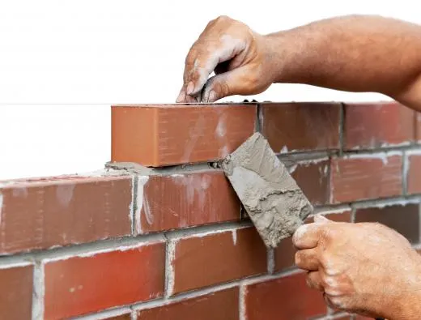

# What is Decomposition?

Decomposition is the process of breaking down complex problems into smaller pieces.

## Why Decompose?

Because...

1. Big and complex problems are hard to solve
2. We can often break a big problem into many small problems.
3. Small and simple problems are easy to solve

*Big things are hard to build...*

*...but big things are built from simple steps.*

