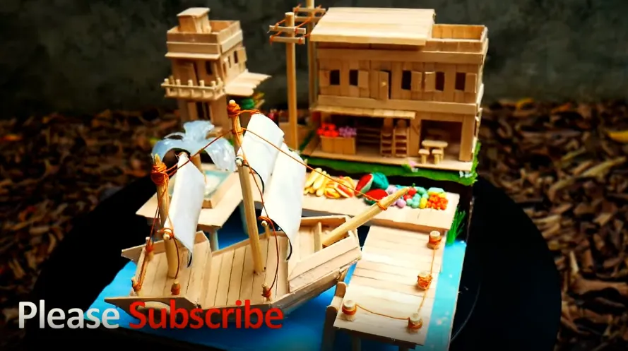
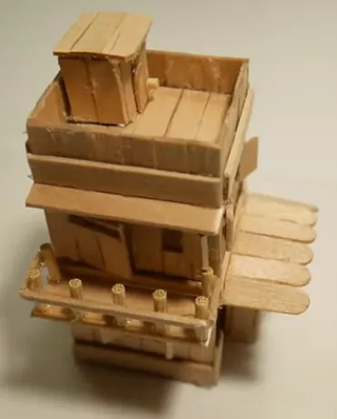
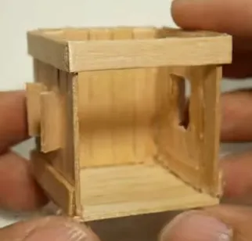
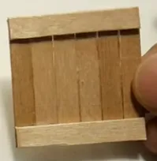

# Example: Popsicle Stick Model

### Can you build this with just popsicle sticks? [PDF Version](https://www.aposteriori.com.sg/wp-content/uploads/decompositionModel.pdf)

That's too complicated! Let's use **decomposition** to break it down into smaller parts.

To build that model, we'll need to...

1. Build the base
2. Build the small building
3. Build the large building
4. Build the ship

### Build the Small Building

Even the small building is rather complicated! Let's **decompose** it some more!

1. Build the base
2. Build the small building
    1. **Build ground floor**
    2. **Build second floor**
    3. **Build top floor**
3. Build the large building
4. Build the ship

### Build the Ground Floor

Build just the ground floor is a lot easier, but let's make it even simpler. We'll **decompose** again!

1. Build the base
2. Build the small building
    1. Build ground floor
        1. **Build floor**
        2. **Build 3 walls**
    2. Build second floor
    3. Build top floor
3. Build the large building
4. Build the ship

### Build the Wall

If it's just one wall, it's really easy to build!