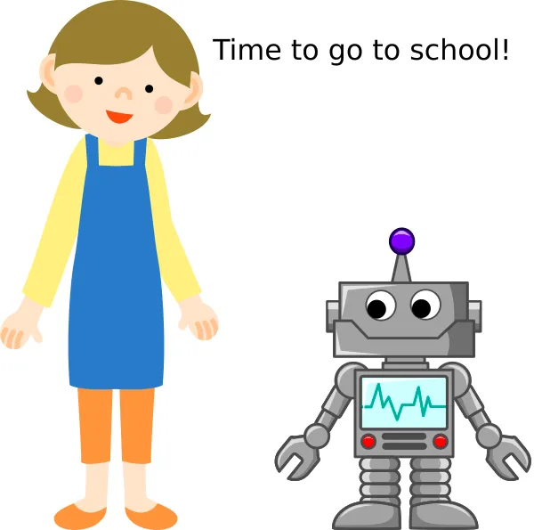
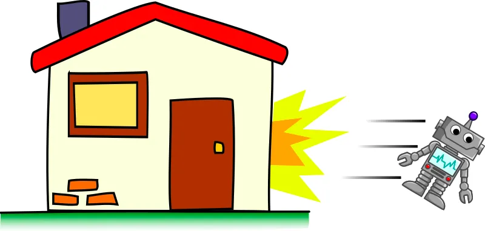

# Importance of Details

When applying **Decomposition**, we can go to break the problem into...

* Many very small steps
* A few bigger steps

Which one to use, depends on who you are decompositing for.

When your mom ask you to go to school in the morning, what does she say?

...or...

Humans are pretty smart!
So we don't need a lot of small steps; we can figure it out on our own.
But robots and computers are not so smart, so we need to give it a lot of small detailed steps...

