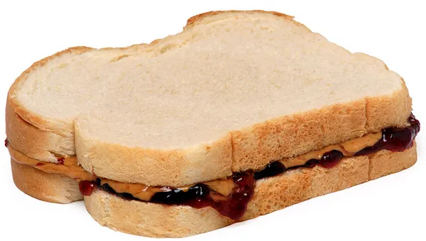

# Example: Make a Sandwich

[Instructor's notes](https://docs.google.com/document/d/1z7bo8QF8mZ2K0_QEzereWLL60uE4IQN2TngY2DouxqI/edit?usp=sharing)

In this exercise, your teacher is going to play the role of a robot.

Your job is to decompose the steps of making a sandwich, and send the instructions to the teacher robot.

## Materials

* Bread (2 slices)
* Peanut butter
* Strawberry jam
* Popsicle stick

## Important!

For the next 5 mins, your teacher is going to be a robot, not a human!
Make sure you decompose your instructions into sufficiently small steps for teacher robot.