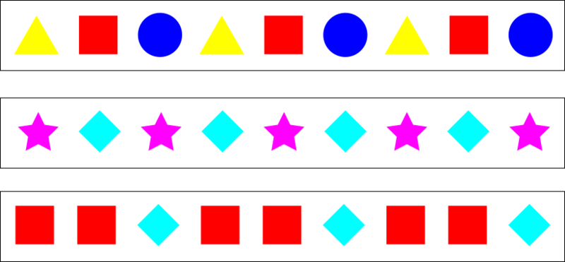
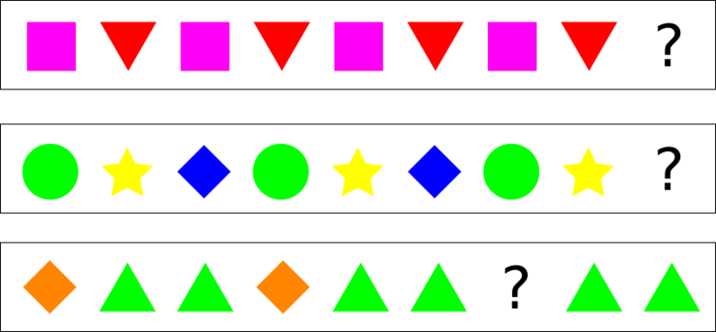
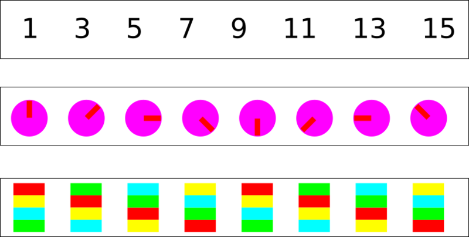
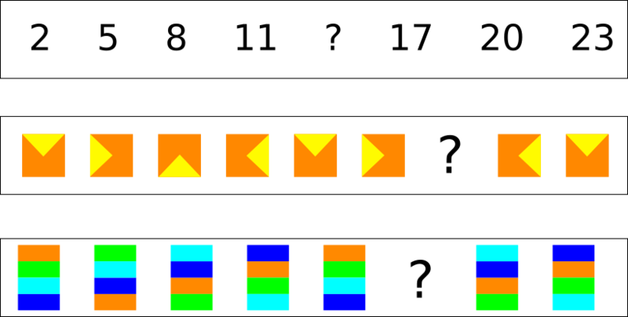
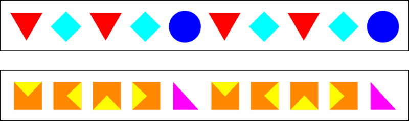
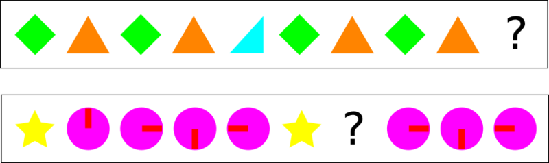

# How to Find Patterns

## Look for things that are the same...

### Example

### Now you try!

## Look for changes...

### Example

### Now you try!

## Find Patterns in Patterns...

### Example

### Now you try!

