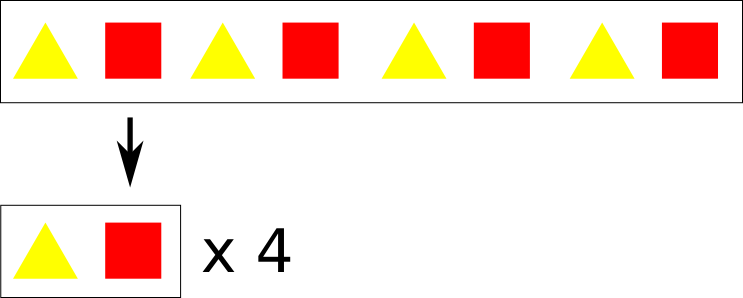
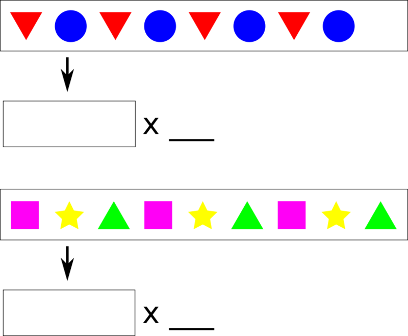
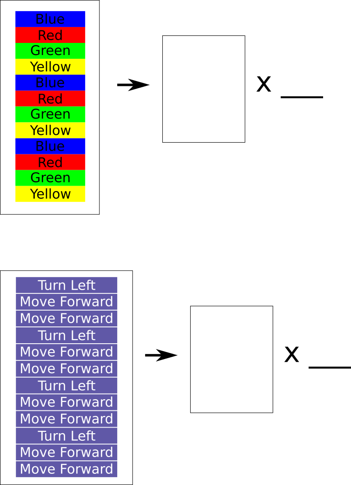
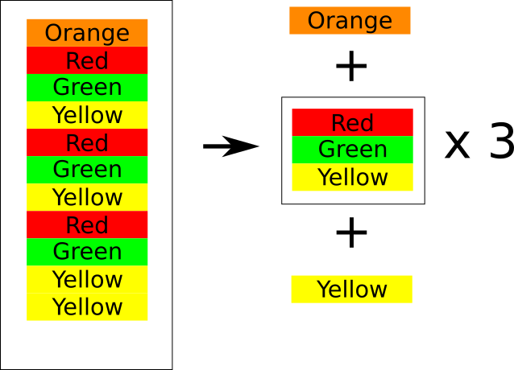
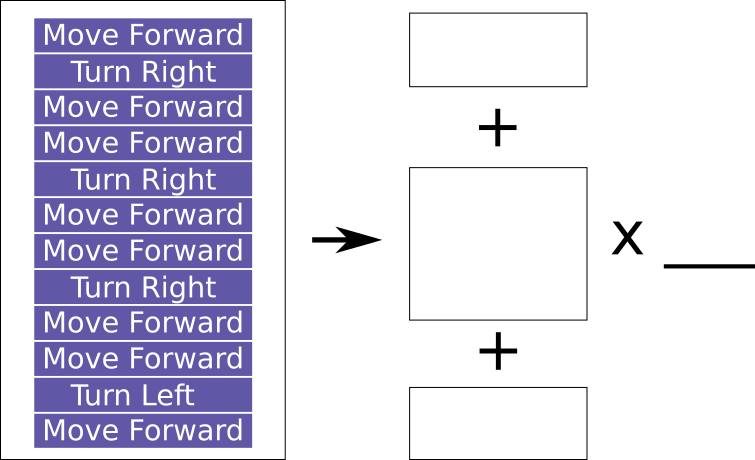
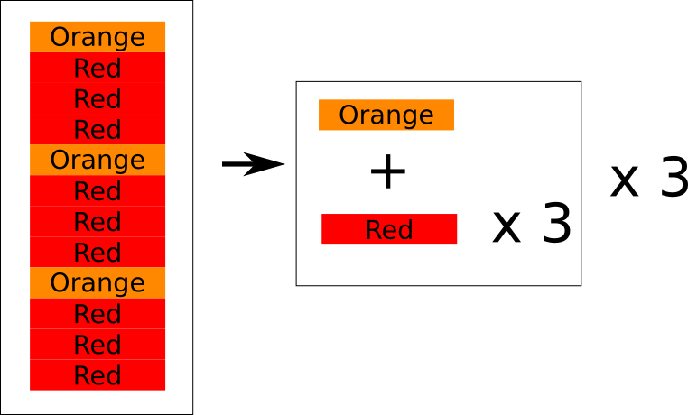
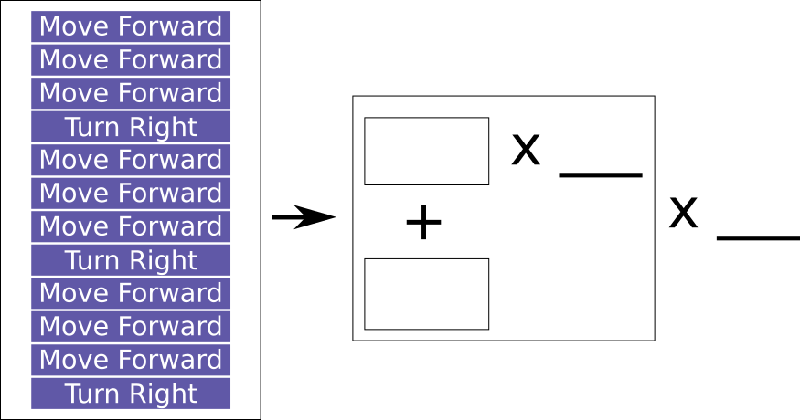

# Simplifying Patterns

Once we have identified the pattern, we can simplify it like this...

## Exercises

Can you simplify these patterns?

### Vertical Patterns

Sometimes, the pattern may be arranged vertically.
Can you simplify these?

## Exclusion

Sometimes, not everthing will fit into the pattern.
Those parts that don't fit will need to be excluded.
Here's an example...

### Now you try!

## Pattern in Pattern

You can also find patterns within patterns.
Here's an example...

### Now you try!

