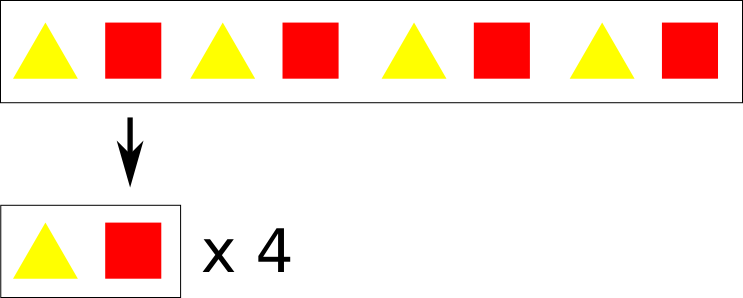
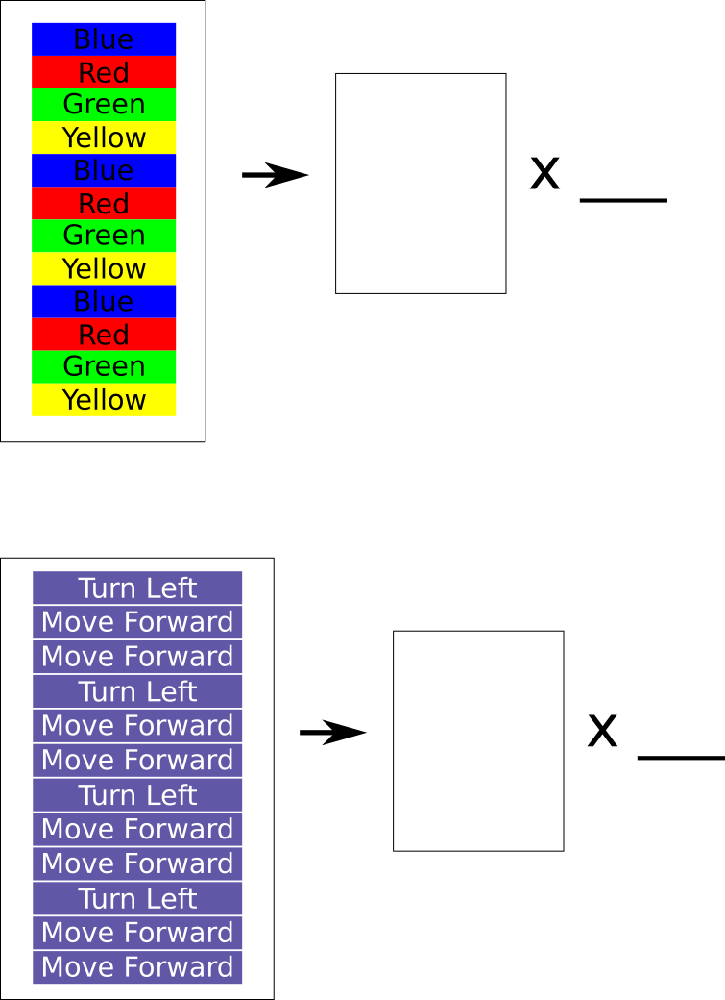

# Simplifying Patterns (Part 1)

Once we have identified the pattern, we can simplify it like this...

## Exercises

Can you simplify these patterns?

### Vertical Patterns

Sometimes, the pattern may be arranged vertically.
Can you simplify these?

