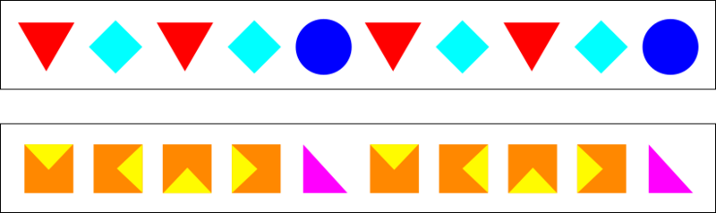
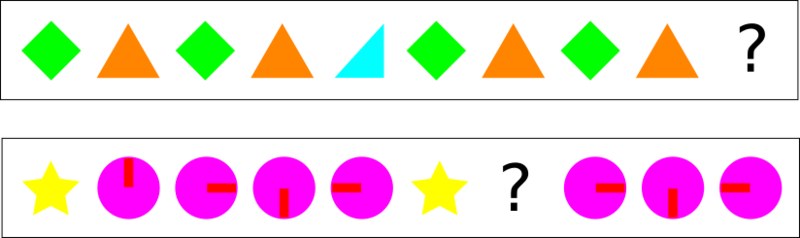

# How to Find Patterns (Part 2)

In the last lesson, we learned how to find patterns by looking at things that are the same, or by looking at how much they have changed.

Sometimes, we can also have patterns inside a pattern...

## Find Patterns in Patterns...

### Example

### Now you try!

