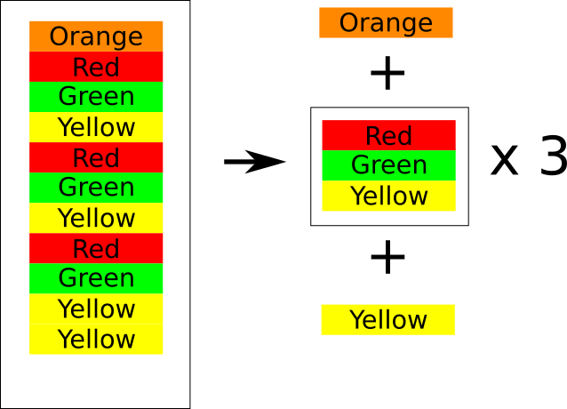
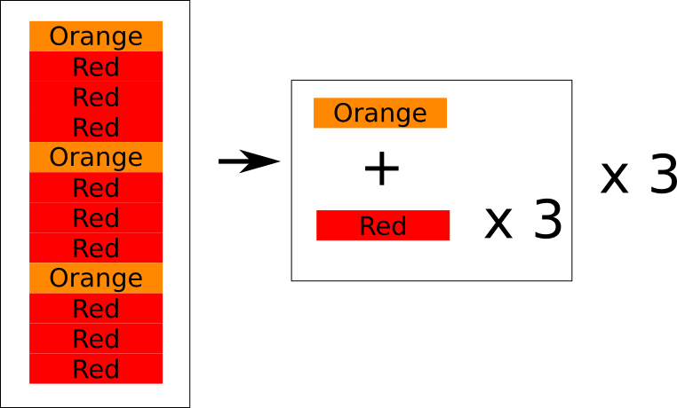

# Simplifying Patterns (Part 2)

## Exclusion

Sometimes, not everthing will fit into the pattern.
Those parts that don't fit will need to be excluded.
Here's an example...

### Now you try!

## Pattern in Pattern

You can also find patterns within patterns.
Here's an example...

### Now you try!

