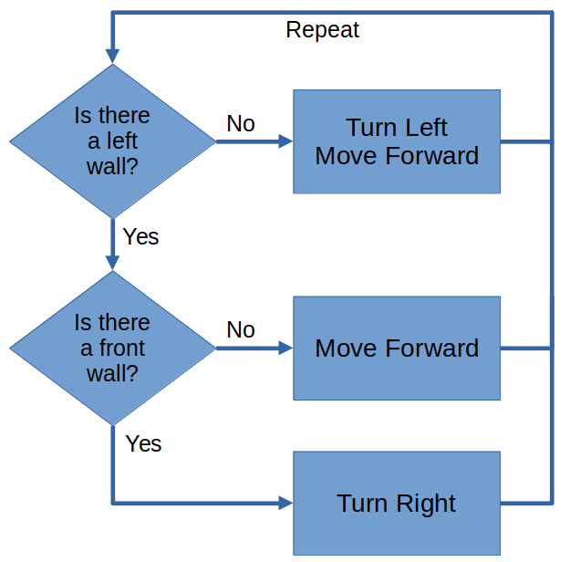
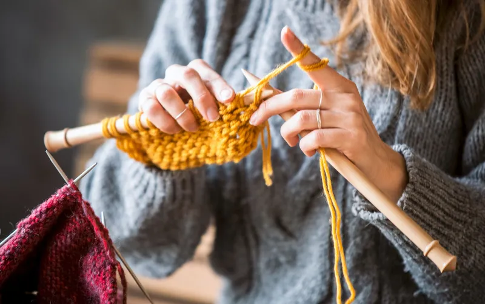

# Benefits of Patterns
 
 

<link rel="stylesheet" href="../../css/skulpt_box.css"></link>

Pattern lets you solve complicated problems with simple solutions.
Here's an example...

<iframe width="560" height="315" src="https://www.youtube.com/embed/1IJO9EYzUwQ" title="YouTube video player" frameborder="0" allow="accelerometer; autoplay; clipboard-write; encrypted-media; gyroscope; picture-in-picture; web-share" allowfullscreen></iframe>

It may look complicated, but the solution, is just...

Patterns isn't just used for maze and robots, we can also use it to create interesting patterns like this...

import turtle
import random

colors = ["red", "green", "blue", "yellow", "orange", "purple"]

turtle.speed(10)

for a in range(100):
    choice = random.randrange(4)
    turtle.color(colors[choice])
    turtle.forward(a)
    turtle.left(92)

...and this...

import turtle
import random

colors = ["red", "green", "blue", "yellow", "orange", "purple"]

turtle.speed(10)

for a in range(100):
    choice = random.randrange(4)
    turtle.color(colors[choice])
    turtle.forward(100)
    turtle.left(92)

## Patterns in Everyday Life

Patterns are also found in everyday life, such as...

### Knitting

### Building Homes

### In Nature

