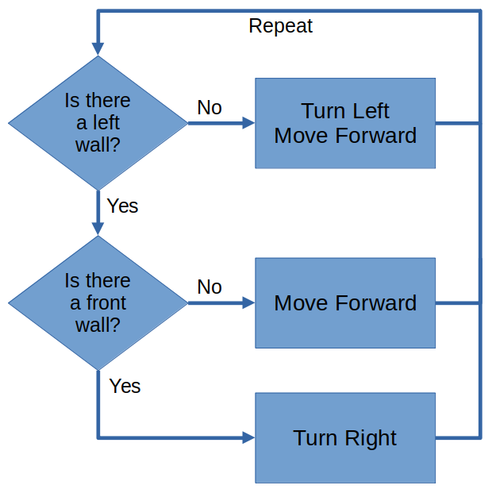

# Benefits of Patterns

Pattern lets you solve complicated problems with simple solutions.
Here's an example...

<iframe width="560" height="315" src="https://www.youtube.com/embed/1IJO9EYzUwQ" title="YouTube video player" frameborder="0" allow="accelerometer; autoplay; clipboard-write; encrypted-media; gyroscope; picture-in-picture; web-share" allowfullscreen></iframe>

It may look complicated, but the solution, is just...

Patterns isn't just used for maze and robots, we can also use it to create interesting patterns like this...

<iframe src="https://trinket.io/embed/python/dee630d077?outputOnly=true&runOption=run" width="100%" height="600" frameborder="0" marginwidth="0" marginheight="0" allowfullscreen></iframe>

...and this...

<iframe src="https://trinket.io/embed/python/2498e9a200?outputOnly=true&runOption=run" width="100%" height="600" frameborder="0" marginwidth="0" marginheight="0" allowfullscreen></iframe>

## Patterns in Everyday Life

Patterns are also found in everyday life, such as...

### Knitting

### Building Homes

### In Nature

