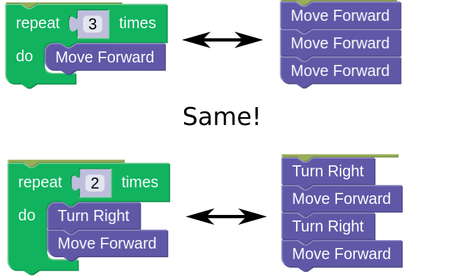
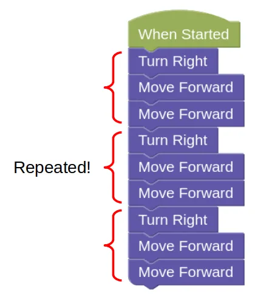

# Loops

To repeat something, we can use the `repeat` block, which is found under the `Loops` category.

Any blocks that you put inside the `repeat` block will be repeated by the specified number of times.

## Example

For each of these challenges, you'll need to complete the challenge using as few blocks as possible.

- [Example challenge](https://gears.aposteriori.com.sg/index.html?worldJSON=https%3A%2F%2Ffiles.aposteriori.com.sg%2Fget%2Ftf8wy6qAVo.json&filterBlocksJSON=https%3A%2F%2Ffiles.aposteriori.com.sg%2Fget%2FESbF3weeEV.json&worldScripts=challenges_basic)

Make sure to click the *Mission* button to see how many blocks you are allowed to use.

You can solve this easily using just `Turn Right` and `Move Forward` blocks...

...but you'll use too many blocks this way.

### Repeat

Can you find the pattern in the earlier solution?

We can make use of patterns to simplify this solution!

## Challenges

For each challenge, click on the *Simulator Tab*, then the *Mission* button to see the mission you need to do.
Each challenge will have a different blocks limit, so make sure to check each time!

Follow the instructions and note down the *special Code* after doing the challenge successfully!

### Loops Challenge 1

- Load [this challenge](https://gears.aposteriori.com.sg/index.html?worldJSON=https%3A%2F%2Ffiles.aposteriori.com.sg%2Fget%2FHqQeiGTXNH.json&filterBlocksJSON=https%3A%2F%2Ffiles.aposteriori.com.sg%2Fget%2FESbF3weeEV.json&worldScripts=challenges_basic)

- Tip: There's no need to sleep inside the block if your robot ends its program inside it.

### Loops Challenge 2

- Load [this challenge](https://gears.aposteriori.com.sg/index.html?worldJSON=https%3A%2F%2Ffiles.aposteriori.com.sg%2Fget%2FjQEycHT6XZ.json&filterBlocksJSON=https%3A%2F%2Ffiles.aposteriori.com.sg%2Fget%2FESbF3weeEV.json&worldScripts=challenges_basic)

### Loops Challenge 3

- Load [this challenge](https://gears.aposteriori.com.sg/index.html?worldJSON=https%3A%2F%2Ffiles.aposteriori.com.sg%2Fget%2FYWYTrrX7Ao.json&filterBlocksJSON=https%3A%2F%2Ffiles.aposteriori.com.sg%2Fget%2FESbF3weeEV.json&worldScripts=challenges_basic)

- Hint: You may need to use more than one repeat loop. Also, it's ok to make an extra turn if it helps you stay within the blocks limit.

### Loops Challenge 4

- Load [this challenge](https://gears.aposteriori.com.sg/index.html?worldJSON=https%3A%2F%2Ffiles.aposteriori.com.sg%2Fget%2FwqEFG9QKzr.json&filterBlocksJSON=https%3A%2F%2Ffiles.aposteriori.com.sg%2Fget%2FESbF3weeEV.json&worldScripts=challenges_basic)

- Hint: Not every block needs to be inside a loop.

### Loops Challenge 5

- Load [this challenge](https://gears.aposteriori.com.sg/index.html?worldJSON=https%3A%2F%2Ffiles.aposteriori.com.sg%2Fget%2Fz386WiC64X.json&filterBlocksJSON=https%3A%2F%2Ffiles.aposteriori.com.sg%2Fget%2FESbF3weeEV.json&worldScripts=challenges_basic)

### Loops Challenge 6

- Load [this challenge](https://gears.aposteriori.com.sg/index.html?worldJSON=https%3A%2F%2Ffiles.aposteriori.com.sg%2Fget%2F9Km3fseepa.json&filterBlocksJSON=https%3A%2F%2Ffiles.aposteriori.com.sg%2Fget%2FESbF3weeEV.json&worldScripts=challenges_basic)
