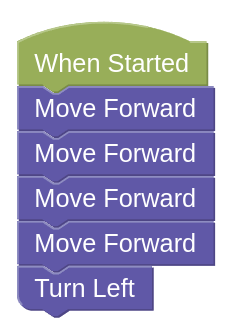
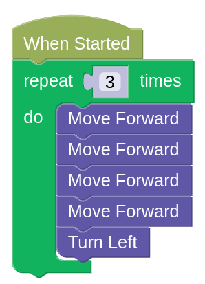
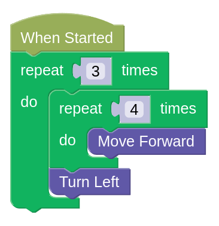
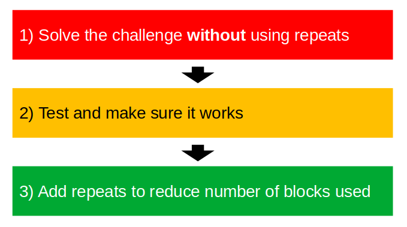

# Repeat (Part 2)

The `Repeat` challenges can be hard to do, and it gets even harder when you need to use more than one loop.

Best way to solve these challenges, would be to first solve it without loops.

## Example (Loop in Loop)

- [Example challenge](https://gears.aposteriori.com.sg/index.html?worldJSON=https%3A%2F%2Ffiles.aposteriori.com.sg%2Fget%2F6gXJj5T6zy.json&filterBlocksJSON=https%3A%2F%2Ffiles.aposteriori.com.sg%2Fget%2FESbF3weeEV.json&worldScripts=challenges_basic)

Let's start by moving forward 4 times, then turning left...

We'll need to repeat this 3 times, so we'll put it in a `repeat 3` loop...

...but that's still too many blocks! Can we reduce it further?

Notice that the `Move Forward` block is repeated 4 times? We can change that into...

## IMPORTANT!

### Loops Challenge 3

- Load [this challenge](https://gears.aposteriori.com.sg/index.html?worldJSON=https%3A%2F%2Ffiles.aposteriori.com.sg%2Fget%2FYWYTrrX7Ao.json&filterBlocksJSON=https%3A%2F%2Ffiles.aposteriori.com.sg%2Fget%2FESbF3weeEV.json&worldScripts=challenges_basic)

- Hint: You may need to use more than one repeat loop. Also, it's ok to make an extra turn if it helps you stay within the blocks limit.

### Loops Challenge 4

- Load [this challenge](https://gears.aposteriori.com.sg/index.html?worldJSON=https%3A%2F%2Ffiles.aposteriori.com.sg%2Fget%2FwqEFG9QKzr.json&filterBlocksJSON=https%3A%2F%2Ffiles.aposteriori.com.sg%2Fget%2FESbF3weeEV.json&worldScripts=challenges_basic)

- Hint: Not every block needs to be inside a loop.

### Loops Challenge 5

- Load [this challenge](https://gears.aposteriori.com.sg/index.html?worldJSON=https%3A%2F%2Ffiles.aposteriori.com.sg%2Fget%2F9EmJ8PuUdV.json&filterBlocksJSON=https%3A%2F%2Ffiles.aposteriori.com.sg%2Fget%2FESbF3weeEV.json&worldScripts=challenges_basic)

### Loops Challenge 5b

- Load [this challenge](https://gears.aposteriori.com.sg/index.html?worldJSON=https%3A%2F%2Ffiles.aposteriori.com.sg%2Fget%2FJiBEhhoKSS.json&filterBlocksJSON=https%3A%2F%2Ffiles.aposteriori.com.sg%2Fget%2FESbF3weeEV.json&worldScripts=challenges_basic)

### Loops Challenge 6

- Load [this challenge](https://gears.aposteriori.com.sg/index.html?worldJSON=https%3A%2F%2Ffiles.aposteriori.com.sg%2Fget%2F9Km3fseepa.json&filterBlocksJSON=https%3A%2F%2Ffiles.aposteriori.com.sg%2Fget%2FESbF3weeEV.json&worldScripts=challenges_basic)
