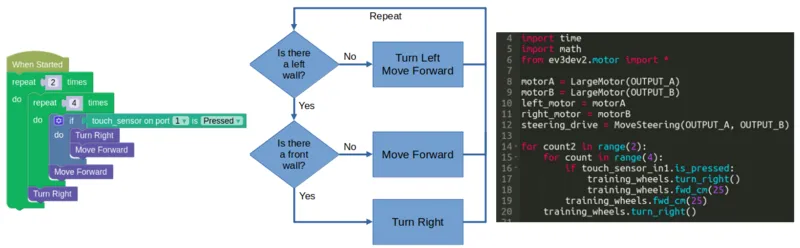
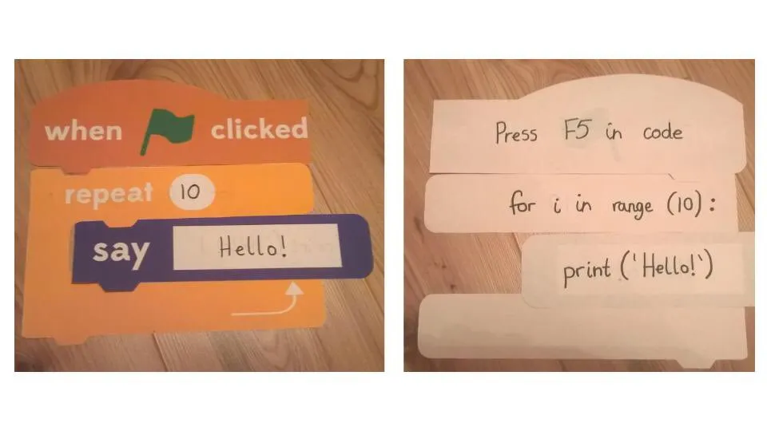

# What are Algorithms?

Algorithms are the step-by-step instructions we use to complete a task.

*These are all algorithms!*

Algorithms can be created in many forms, including...

* Text (eg. Python, Javascript)
* Flow charts
* Blocks (eg. Scratch, GearsBot)
* Paper and Cardboard!

