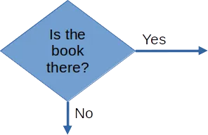
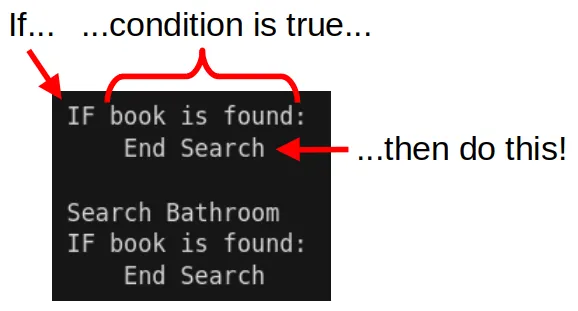

# Conditions

In the previous exercise, you would have seen symbols that looks like this...



This is a **Condition**.
It checks if something is **True** or **False**, and decides what to do based on the answer.

## "IF" condition

In programming, we typically use an "IF" block.
So to search for the book, we might do something like this...

```
Search Kitchen
IF book is found:
    End Search

Search Bathroom
IF book is found:
    End Search
```


