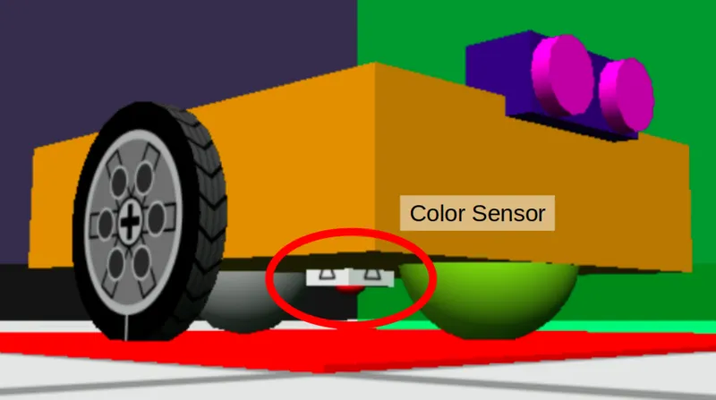

# IF and ELSE

In blocks programming, we have the **IF** block

We can use this with the color sensor block...

...to create something like this...

# Color Sensor

The color sensor is at the bottom of the robot, pointing downwards.

It can see the color that is below the robot.

## ELSE

We can also add an **ELSE** to the **IF** block...

<video width="448" height="404" autoplay loop muted>
    <source src="images/addElse.mp4" type="video/mp4">
</video>

When the condition is **False**, the program will perform the steps inside **ELSE**.

In the above example, if the robot sees **Green**, it will turn right **ELSE** it will turn left.

Quiz: Which way will the robot turn if it sees Red?

