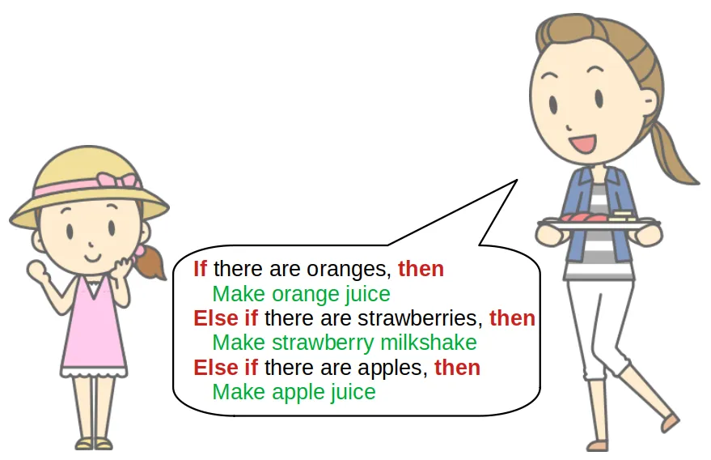
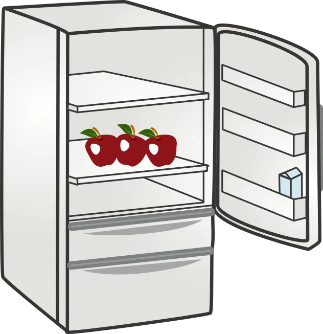
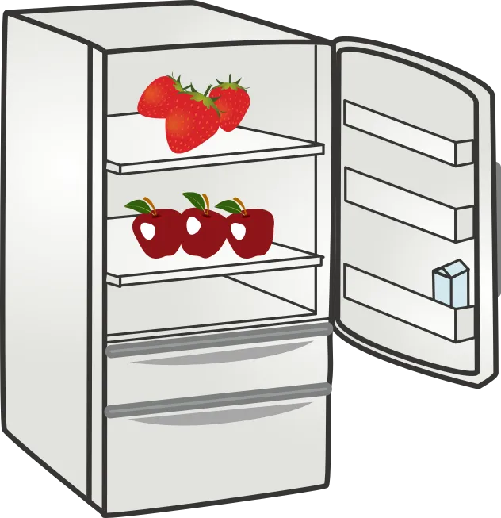
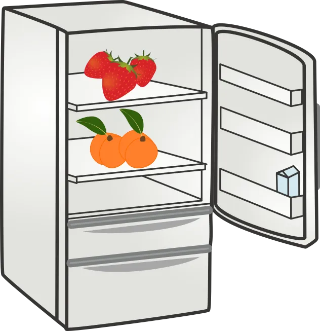
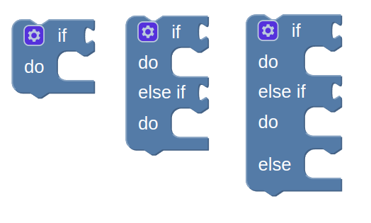
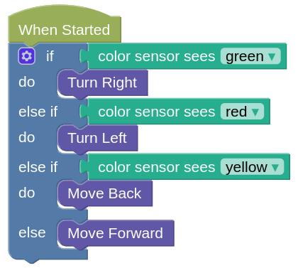

# ELSE IF

Let's say you are preparing for a party, and your mum asked you to help prepare the drinks.

You check the fridge and you see...

What drinks should you prepare?

What if you see this in the fridge...

...or this...

## ELSE IF block

In blocks programming, we always start with the **IF** block, but we can add an **ELSE IF** and an **ELSE** to it.

The **ELSE IF** let us check for many different colors...

Quiz: Which way will the robot move if it sees Yellow?

You can add the **ELSE IF** by...

<video width="448" height="404" autoplay loop muted>
    <source src="images/addElseIf.mp4" type="video/mp4">
</video>
