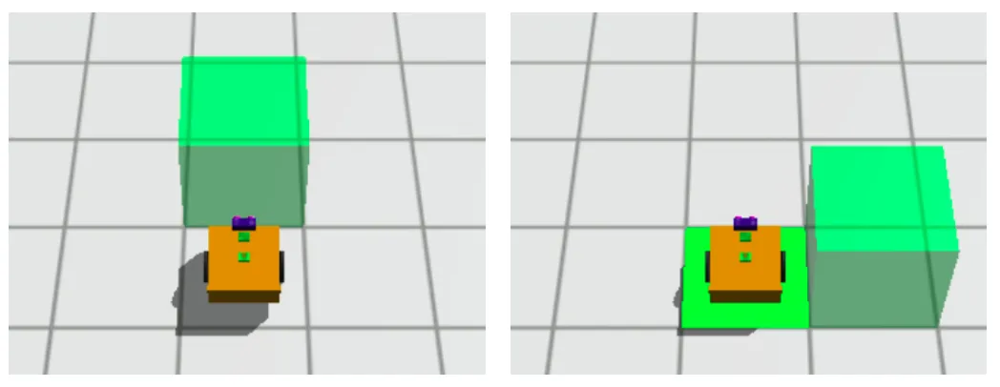
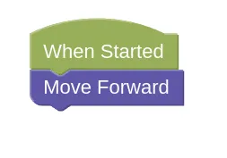
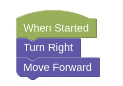
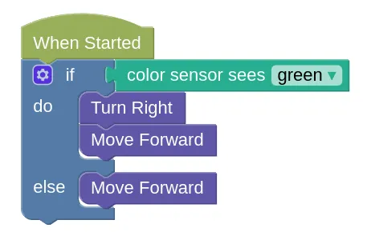

# Conditions (Part 1)

For this series of challenges, we will need to use the color sensor to determine which way to move.

To properly complete the missions, you will need to reset and run the program a few times.
This is to make sure your robot can handle all the possible conditions, and not just one.

## Example

- [Example challenge](https://gears.aposteriori.com.sg/index.html?worldJSON=https%3A%2F%2Ffiles.aposteriori.com.sg%2Fget%2FbjAqw2gbLT.json&filterBlocksJSON=https%3A%2F%2Ffiles.aposteriori.com.sg%2Fget%2F352uaPiDN7.json&worldScripts=challenges_basic)

Reset the world a few times to see where the green box may appear...

In this example challenge, the box may appear in front of the robot, or to the right of the robot.

If the box is in front...

If the box is to the right...

How can we decide which blocks to use?

### Color Sensor

Notice that the ground below the robot is **Green** when the box is on the right, and white when the box is in front?

We can use a condition to check the color of the ground, then decide which way to move.

The example above uses 5 blocks. Can you reduce it to 4 blocks?

## Challenges

For each challenge, click on the *Simulator Tab*, then the *Mission* button to see the mission you need to do.

Follow the instructions and note down the *special Code* after doing the challenge successfully!

### Conditions Challenge 1

- Load [this challenge](https://gears.aposteriori.com.sg/index.html?worldJSON=https%3A%2F%2Ffiles.aposteriori.com.sg%2Fget%2FoM99WC55Su.json&filterBlocksJSON=https%3A%2F%2Ffiles.aposteriori.com.sg%2Fget%2F352uaPiDN7.json&worldScripts=challenges_basic)

- Optional Bonus: Complete this challenge using only 5 blocks.

### Conditions Challenge 2

- Load [this challenge](https://gears.aposteriori.com.sg/index.html?worldJSON=https%3A%2F%2Ffiles.aposteriori.com.sg%2Fget%2F8K64etUnHk.json&filterBlocksJSON=https%3A%2F%2Ffiles.aposteriori.com.sg%2Fget%2F352uaPiDN7.json&worldScripts=challenges_basic)

- Optional Bonus: Complete this challenge using only 7 blocks.

### Conditions Challenge 3

- Load [this challenge](https://gears.aposteriori.com.sg/index.html?worldJSON=https%3A%2F%2Ffiles.aposteriori.com.sg%2Fget%2FeXgVxY9zDH.json&filterBlocksJSON=https%3A%2F%2Ffiles.aposteriori.com.sg%2Fget%2F352uaPiDN7.json&worldScripts=challenges_basic)

- Optional Bonus: Complete this challenge using only 8 blocks.

### Conditions Challenge 4

- Load [this challenge](https://gears.aposteriori.com.sg/index.html?worldJSON=https%3A%2F%2Ffiles.aposteriori.com.sg%2Fget%2FyeCJq85j9C.json&filterBlocksJSON=https%3A%2F%2Ffiles.aposteriori.com.sg%2Fget%2F352uaPiDN7.json&worldScripts=challenges_basic)

- Optional Bonus: Complete this challenge using only 7 blocks.

### Conditions Challenge 5

- Load [this challenge](https://gears.aposteriori.com.sg/index.html?worldJSON=https%3A%2F%2Ffiles.aposteriori.com.sg%2Fget%2FA5jp5gh9ba.json&filterBlocksJSON=https%3A%2F%2Ffiles.aposteriori.com.sg%2Fget%2F352uaPiDN7.json&worldScripts=challenges_basic)

- Optional Bonus: Complete this challenge using only 13 blocks.