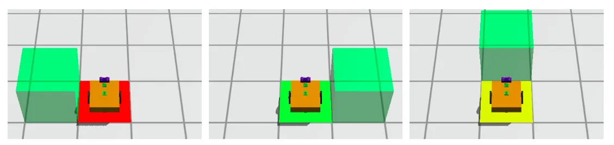
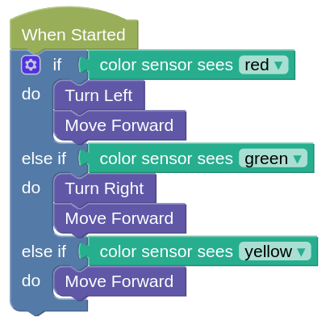

# Conditions (Part 2)

This series of challenges is similar to the previous one, but with more colors to check.

To properly complete the missions, you will need to reset and run the program a few times.
Your robot must handle all possible randomization without changes to the program.

## Example

- [Example challenge](https://gears.aposteriori.com.sg/index.html?worldJSON=https%3A%2F%2Ffiles.aposteriori.com.sg%2Fget%2FZRWmoNHhhM.json&filterBlocksJSON=https%3A%2F%2Ffiles.aposteriori.com.sg%2Fget%2F352uaPiDN7.json&worldScripts=challenges_basic)

Reset the world a few times to see where the green box may appear...

In this example challenge, the box may appear on the left (red), right (green), or front (yellow) of the robot.

We can use a condition to check the color of the ground, then decide which way to move.

Do we really need an "ELSE IF" for the yellow? Can we just use an "Else"?

## Challenges

For each challenge, click on the *Simulator Tab*, then the *Mission* button to see the mission you need to do.

Follow the instructions and note down the *special Code* after doing the challenge successfully!

### Conditions Challenge 6

- Load [this challenge](https://gears.aposteriori.com.sg/index.html?worldJSON=https%3A%2F%2Ffiles.aposteriori.com.sg%2Fget%2FTJz7Rdjp4M.json&filterBlocksJSON=https%3A%2F%2Ffiles.aposteriori.com.sg%2Fget%2F352uaPiDN7.json&worldScripts=challenges_basic)

- Optional Bonus: Complete this challenge using only 10 blocks.

### Conditions Challenge 7

- Load [this challenge](https://gears.aposteriori.com.sg/index.html?worldJSON=https%3A%2F%2Ffiles.aposteriori.com.sg%2Fget%2FenaXkSGzyn.json&filterBlocksJSON=https%3A%2F%2Ffiles.aposteriori.com.sg%2Fget%2F352uaPiDN7.json&worldScripts=challenges_basic)

- Optional Bonus: Complete this challenge using only 10 blocks.

### Conditions Challenge 8

- Load [this challenge](https://gears.aposteriori.com.sg/index.html?worldJSON=https%3A%2F%2Ffiles.aposteriori.com.sg%2Fget%2FHWJ4amgGtU.json&filterBlocksJSON=https%3A%2F%2Ffiles.aposteriori.com.sg%2Fget%2F352uaPiDN7.json&worldScripts=challenges_basic)

- You'll need two **IF** blocks for this.

### Conditions Challenge 9

- Load [this challenge](https://gears.aposteriori.com.sg/index.html?worldJSON=https%3A%2F%2Ffiles.aposteriori.com.sg%2Fget%2FMewaArKBhA.json&filterBlocksJSON=https%3A%2F%2Ffiles.aposteriori.com.sg%2Fget%2F352uaPiDN7.json&worldScripts=challenges_basic)

- Optional Bonus: Complete this challenge using only 9 blocks.

### Conditions Challenge 10

- Load [this challenge](https://gears.aposteriori.com.sg/index.html?worldJSON=https%3A%2F%2Ffiles.aposteriori.com.sg%2Fget%2FkDt6NbkPSN.json&filterBlocksJSON=https%3A%2F%2Ffiles.aposteriori.com.sg%2Fget%2F352uaPiDN7.json&worldScripts=challenges_basic)

- Optional Bonus: Complete this challenge using only 9 blocks.

### Conditions Challenge 11

- Load [this challenge](https://gears.aposteriori.com.sg/index.html?worldJSON=https%3A%2F%2Ffiles.aposteriori.com.sg%2Fget%2FeY8KAwjFkz.json&filterBlocksJSON=https%3A%2F%2Ffiles.aposteriori.com.sg%2Fget%2F352uaPiDN7.json&worldScripts=challenges_basic)

- This one is like Challenge 7, but with an added twist.

### Conditions Challenge 12

- Load [this challenge](https://gears.aposteriori.com.sg/index.html?worldJSON=https%3A%2F%2Ffiles.aposteriori.com.sg%2Fget%2FrF3bd8K2cn.json&filterBlocksJSON=https%3A%2F%2Ffiles.aposteriori.com.sg%2Fget%2F352uaPiDN7.json&worldScripts=challenges_basic)

- This one is like Challenge 8, but with an added twist.
