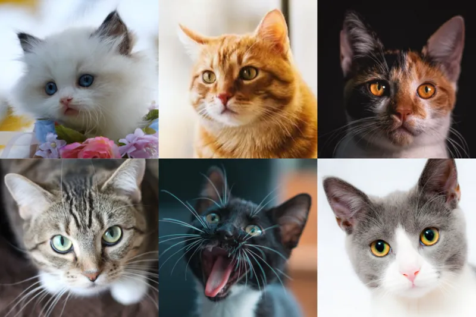

# What is Abstraction?

Abstraction is about separating the general (...important) from the specific (...not so important).

## What are General and Specific?

Here's an example.
Can you tell me what are these?

*(Hint: They are cats!)*

### General Characteristics

What makes a cat, a cat?

* Two eyes
* Four legs
* Fur
* Triangular shaped ears
* Whiskers
* Tail

### Specific Characteristics

What are different about the cats in the picture?

* Color (White, black, orange)
* Fur pattern (Stripes, patches, single color)
* Eye color (Yellow, green, blue)
