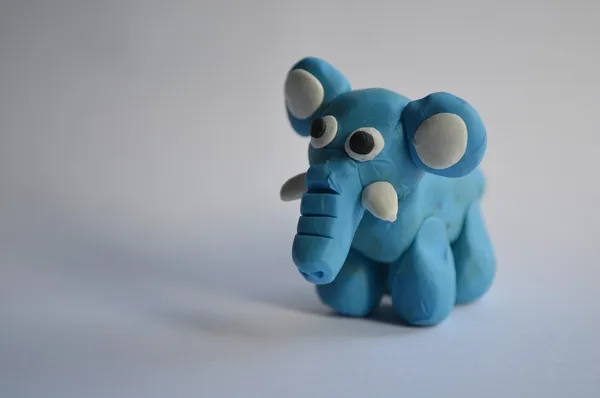

# Abstraction Game

Let's play a game to practice **Including** and **Ignoring**!

## How to Play

* One student will be selected each time to come up to the front.
* The student will be shown a single word and given some materials to construct a model representing the word.
* Everyone else will need to guess what the student is making.

## Rules

* Time limit of 2 mins.
* The student at the front cannot talk.
* Cannot use the materials to form letters or numbers.
* Think carefully what to **include** in your model and what to **ignore**!

## Discussion

After each round, quickly discuss what enabled the guesser to figure out what the item is.