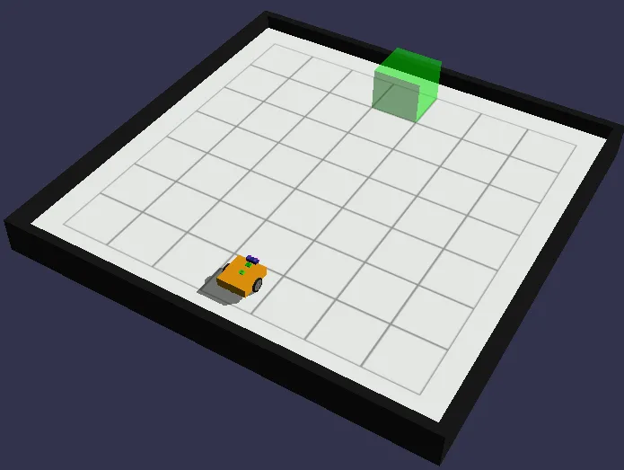
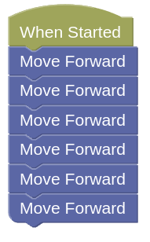
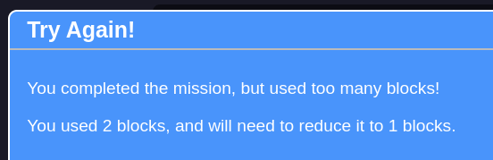
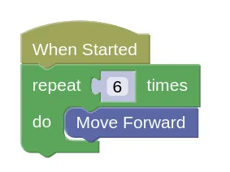
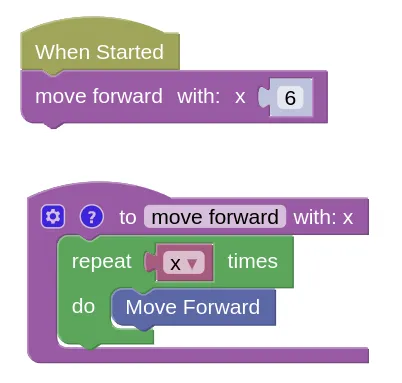

# Challenges (Part 2)

Most of these challenges have a blocks limit.
To help solve them, we will learn a new abstraction technique called **Functions**.

## Example

- [Example challenge](https://gears.aposteriori.com.sg/index.html?worldJSON=https%3A%2F%2Ffiles.aposteriori.com.sg%2Fget%2FbPXmGhAbMa.json&filterBlocksJSON=https%3A%2F%2Ffiles.aposteriori.com.sg%2Fget%2FPEV2aN2yDg.json&worldScripts=challenges_basic)

This challenges is really easy...

...but you are only allowed **ONE** block!

We can reduce it down to 2 blocks using a loop...

...but how to get it down to 1 block?

We can use a function to solve this...

<video width="654" height="524" autoplay loop muted>
    <source src="images/createFunctions.mp4" type="video/mp4">
</video>

Functions takes a little bit more work to prepare, but now whenever we need to move forward, we can use the "move forward" function and tell it how many squares to move.

Create the move forward functions on your own device, and use it to solve the following challenges.

## Challenges

For each challenge, click on the *Simulator Tab*, then the *Mission* button to see the mission you need to do.

Follow the instructions and note down the *special Code* after doing the challenge successfully!

### Challenge 7

- Load [this challenge](https://gears.aposteriori.com.sg/index.html?worldJSON=https%3A%2F%2Ffiles.aposteriori.com.sg%2Fget%2FLJFgC6MAU3.json&filterBlocksJSON=https%3A%2F%2Ffiles.aposteriori.com.sg%2Fget%2FPEV2aN2yDg.json&worldScripts=challenges_basic)

### Challenge 8

- Load [this challenge](https://gears.aposteriori.com.sg/index.html?worldJSON=https%3A%2F%2Ffiles.aposteriori.com.sg%2Fget%2FctsvQ6fnqx.json&filterBlocksJSON=https%3A%2F%2Ffiles.aposteriori.com.sg%2Fget%2FPEV2aN2yDg.json&worldScripts=challenges_basic)

### Challenge 9

- Load [this challenge](https://gears.aposteriori.com.sg/index.html?worldJSON=https%3A%2F%2Ffiles.aposteriori.com.sg%2Fget%2FFSkG5twCsD.json&filterBlocksJSON=https%3A%2F%2Ffiles.aposteriori.com.sg%2Fget%2FPEV2aN2yDg.json&worldScripts=challenges_basic)

### Challenge 10

- Load [this challenge](https://gears.aposteriori.com.sg/index.html?worldJSON=https%3A%2F%2Ffiles.aposteriori.com.sg%2Fget%2FYTUyD96JeC.json&filterBlocksJSON=https%3A%2F%2Ffiles.aposteriori.com.sg%2Fget%2FPEV2aN2yDg.json&worldScripts=challenges_basic)

### Challenge 11

- Load [this challenge](https://gears.aposteriori.com.sg/index.html?worldJSON=https%3A%2F%2Ffiles.aposteriori.com.sg%2Fget%2FhP7sViy6kq.json&filterBlocksJSON=https%3A%2F%2Ffiles.aposteriori.com.sg%2Fget%2FPEV2aN2yDg.json&worldScripts=challenges_basic)

- The position of the green block is randomized. Use the sensor block to decide which way to turn.